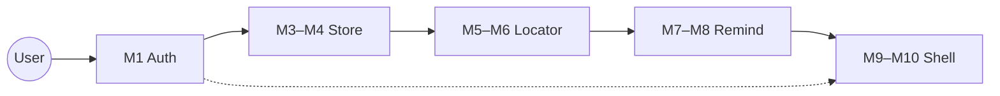
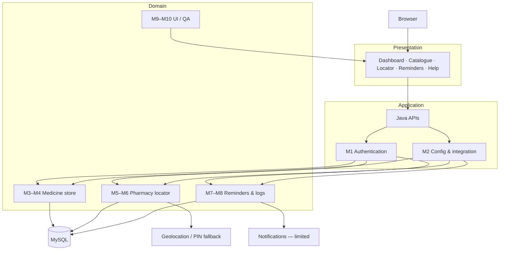
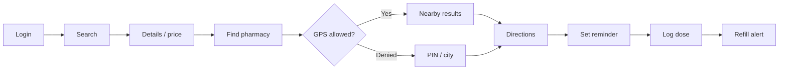
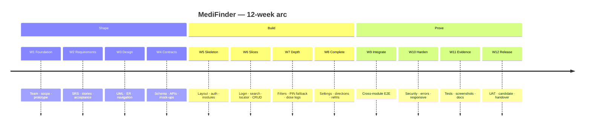
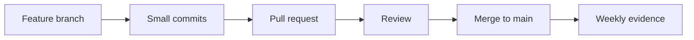

# MediFinder

<p align="center">
  
</p>

<p align="center">
  
</p>

<p align="center">
  A five-member <strong>Java</strong> web system that unifies <strong>medicine discovery</strong>, <strong>nearby pharmacy access</strong>, and <strong>medication adherence</strong> — including PIN fallback when location is blocked, and reminder behaviour that respects browser notification limits.
</p>

<p align="center">
  
  
  
  
</p>

<p align="center">
  <a href="[ADD REPOSITORY LINK]"></a>
  &nbsp;
  <a href="[ADD DEMO LINK]"></a>
  &nbsp;
  <a href="[ADD DEPLOYMENT LINK]"></a>
  &nbsp;
  <a href="#-12-week-development-roadmap"></a>
</p>

<p align="center">
  
</p>

---

<p align="center">
  <a href="#-at-a-glance">Glance</a> ·
  <a href="#-the-problem">Problem</a> ·
  <a href="#-the-product">Product</a> ·
  <a href="#-capabilities">Capabilities</a> ·
  <a href="#-modules">Modules</a> ·
  <a href="#️-architecture">Architecture</a> ·
  <a href="#-user-journey">Journey</a> ·
  <a href="#-team">Team</a> ·
  <a href="#-12-week-development-roadmap">Roadmap</a> ·
  <a href="#-github-workflow">GitHub</a> ·
  <a href="#-quality">Quality</a> ·
  <a href="#-interface">Interface</a>
</p>

---

## 📌 At a Glance

<table>
  <tr>
    <td align="center" width="25%">
      <br>
      <sub>DURATION</sub><br>
      <strong>12 weeks</strong><br>
      <sub>06 Jul – 06 Oct 2026</sub>
    </td>
    <td align="center" width="25%">
      <br>
      <sub>TEAM</sub><br>
      <strong>5 members</strong><br>
      <sub>one shared repository</sub>
    </td>
    <td align="center" width="25%">
      <br>
      <sub>SCOPE</sub><br>
      <strong>10 modules</strong><br>
      <sub>M1 – M10</sub>
    </td>
    <td align="center" width="25%">
      <br>
      <sub>CORE STACK</sub><br>
      <strong>Java · MySQL</strong><br>
      <sub>JDBC · browser APIs</sub>
    </td>
  </tr>
</table>

| | |
|---|---|
| **Product** | Account-aware Java web platform for medicine search, pharmacy access, and dose follow-up |
| **Target failure** | Split tools for catalogue, GPS-only locators, and reminders that ignore permission limits |
| **Access model** | Authenticated session (M1) — catalogue, locator and reminders stay account-scoped |
| **Honesty boundary** | Not a marketplace, not a diagnosis engine, not guaranteed push delivery |
| **Status** | Academic engineering build · evidence-driven (PRs, checklists, screenshots) |

> **Design rule:** GPS denied, empty search, and blocked notifications are *features of the product* — not exceptions to hide.

---

## 🎯 The Problem

Medication days fail in three separate places. MediFinder treats them as one workflow.

<table>
<tr>
<td width="33%" valign="top">

<p align="center">
  
</p>

### Fragmented medicine data

Brand vs generic, strength, pack, manufacturer, **MRP vs seller price**, source and last update time almost never live in one view.

Case-sensitive or inconsistent search returns empty or wrong rows.

</td>
<td width="33%" valign="top">

<p align="center">
  
</p>

### GPS-only locators

A nearby-pharmacy screen that only works with coordinates is dead when the browser **denies location**.

Users still need PIN / city fallback, a denied-permission state, and directions that do not pretend GPS succeeded.

</td>
<td width="33%" valign="top">

<p align="center">
  
</p>

### Fragile reminders

Doses are taken, missed or skipped. Refills have thresholds. Browsers **limit notifications**.

A reminder that shows a different time after refresh is worse than no reminder.

</td>
</tr>
</table>

---

## 💡 The Product

Ten owned modules. One session. One repository.

```text
Sign in
  →  Search the catalogue
  →  Open details & price provenance
  →  Find a nearby pharmacy
  →  Use GPS  or  PIN / city fallback
  →  Open directions
  →  Set a reminder
  →  Log taken / missed / skipped
  →  Watch refill warnings
  →  Dashboard · profile · settings · help
```

| Layer | What the user actually gets |
|---|---|
| **Identity** | Secure login, authorization, common API errors, account-scoped records |
| **Discovery** | Search / filter medicines; manufacturer, strength, pack, MRP vs seller price, source, update time |
| **Access** | Map/list pharmacies, address & contact, permission handling, manual PIN fallback, directions |
| **Adherence** | Reminder CRUD, schedules, dose logs, refill warnings, notification-limitation messaging |
| **Experience** | Prototype-faithful UI, dashboard, profile, settings, help, QA evidence and demo support |



---

## ✨ Capabilities

<table>
<tr>
<td width="33%" valign="top">

### 🔐 Authentication
Registration, login, authorization around module pages, and shared API error handling so every module has a reliable user context.

</td>
<td width="33%" valign="top">

### 💊 Medicine discovery
Catalogue search and filters across brand / generic naming, with explicit **empty, loading and error** states — not silent failure.

</td>
<td width="33%" valign="top">

### 🏷️ Price provenance
Detail views surface manufacturer, strength, pack, **MRP vs seller price**, source, and last update time.

</td>
</tr>
<tr>
<td width="33%" valign="top">

### 🏪 Pharmacy locator
Nearby search as map / list, plus address and contact for a selected pharmacy.

</td>
<td width="33%" valign="top">

### 📍 Directions & fallback
Location permission is a first-class state. Denied or unavailable GPS → **manual PIN / city**, denied copy, directions links, no-result handling.

</td>
<td width="33%" valign="top">

### ⏰ Reminders
Create, edit and delete schedules with dose instructions — persisted per account.

</td>
</tr>
<tr>
<td width="33%" valign="top">

### 📋 Dose tracking
Log **taken / missed / skipped** and keep history on the logged-in user.

</td>
<td width="33%" valign="top">

### 🔔 Refill alerts
Threshold-based refill warnings, plus honest copy for **browser notification limits**.

</td>
<td width="33%" valign="top">

### 👤 Shell & QA
Dashboard, profile, settings, help, guided UI, checklists, bug reports, screenshots and README.

</td>
</tr>
</table>

---

## 🧩 Modules

Ten modules. Five owners. No overlapping claims.

| ID | Module | Owner | Purpose |
|:---:|---|---|---|
| **M1** | Authentication & Accounts | Ratn Kumar Sharma | Java APIs, secure login, authorization, common errors |
| **M2** | API / Configuration / Integration | Ratn Kumar Sharma | API contracts, configuration, integration, code review |
| **M3** | Medicine Catalogue & Search | Vansh Oberoi | Search / filter over the medicine store |
| **M4** | Medicine Details & Price Provenance | Vansh Oberoi | Details, manufacturer / strength / pack, MRP vs seller price, source & update time |
| **M5** | Pharmacy Locator | Sumit Kumar Saini | Nearby pharmacy search, map / list, address / contact |
| **M6** | Directions & Location Fallback | Sumit Kumar Saini | Permission handling, manual PIN fallback, directions, no-result states |
| **M7** | Medicine Reminders | Sameer Achara | Create / edit / delete schedules and reminder forms |
| **M8** | Dose Logs & Refill Alerts | Sameer Achara | Taken / missed / skipped logs, refill warnings, notification limitations |
| **M9** | Dashboard / Profile / Settings / Help | Sachin Kumawat | Prototype style, guided UI, account-facing pages |
| **M10** | QA / Documentation / Demo | Sachin Kumawat | Test checklists, bug reports, screenshots, README, report |

<details>
<summary><strong>Module responsibility map</strong></summary>

<br/>

| Owner | Modules | Responsibility |
|---|---|---|
| **Ratn Kumar Sharma** | M1 · M2 | Java APIs, secure login, authorization, common errors, code reviews and integration |
| **Vansh Oberoi** | M3 · M4 | Search / filter, medicine details, manufacturer / strength / pack, MRP vs seller price, source and update time |
| **Sumit Kumar Saini** | M5 · M6 | Nearby pharmacy search, map / list, address / contact, permission handling and manual PIN fallback |
| **Sameer Achara** | M7 · M8 | Create / edit / delete schedules, taken / missed / skipped logs, refill warnings and notification limitations |
| **Sachin Kumawat** | M9 · M10 | Preserve prototype style, guided UI support, test checklists, bug reports, screenshots, README and report |

</details>

---

## 🏗️ Architecture

Conceptual only — Java APIs, MySQL, browser geolocation, browser notifications. Nothing else is drawn as if it exists.



| Layer | Responsibility |
|---|---|
| **Presentation** | Prototype-aligned screens for search, details, locator, reminders, dashboard, profile, settings, help |
| **Application** | Java APIs, secure login, authorization, shared configuration, integration seams |
| **Domain** | Catalogue, price provenance, locator, fallback, reminders, dose logs, refill alerts |
| **Data** | MySQL through JDBC |
| **Browser services** | Geolocation and notifications are **client capabilities**, not guaranteed server features |

Secrets, local server files and machine JDBC URLs stay **out of Git**.

---

## 🔄 User Journey



1. Sign in through **M1** so later records stay account-scoped.  
2. Search / filter the catalogue (**M3**), then open details with price provenance (**M4**).  
3. Locate a pharmacy (**M5**). If permission is denied, continue through **M6**.  
4. Create a reminder (**M7**), log taken / missed / skipped, follow refill warnings (**M8**).  
5. Use dashboard, profile, settings and help (**M9**) under the same visual system (**M10**).

---

## 👥 Team

<p align="center"><em>One shared repository · one feature branch per member · review before merge to main</em></p>

<table>
  <tr>
    <td align="center" width="20%">
      <br>
      <strong>Ratn Kumar Sharma</strong><br>
      <sub>Java Backend / Lead</sub><br><br>
      
      
      <br><br>
      <sub>APIs, secure login, authorization, common errors, reviews, integration</sub>
    </td>
    <td align="center" width="20%">
      <br>
      <strong>Vansh Oberoi</strong><br>
      <sub>Medicine Store</sub><br><br>
      
      
      <br><br>
      <sub>Search / filter, manufacturer, strength, pack, MRP vs seller price, source, update time</sub>
    </td>
    <td align="center" width="20%">
      <br>
      <strong>Sumit Kumar Saini</strong><br>
      <sub>Pharmacy Locator</sub><br><br>
      
      
      <br><br>
      <sub>Nearby search, map / list, address / contact, GPS permission, manual PIN fallback</sub>
    </td>
    <td align="center" width="20%">
      <br>
      <strong>Sameer Achara</strong><br>
      <sub>Reminders / Notifications</sub><br><br>
      
      
      <br><br>
      <sub>Schedule CRUD, taken / missed / skipped logs, refill warnings, notification limitations</sub>
    </td>
    <td align="center" width="20%">
      <br>
      <strong>Sachin Kumawat</strong><br>
      <sub>UI / UX, QA & Docs</sub><br><br>
      
      
      <br><br>
      <sub>Prototype style, guided UI, checklists, bug reports, screenshots, README</sub>
    </td>
  </tr>
</table>

Sameer Achara owns **only** M7 and M8. Sachin Kumawat leads guided UI, QA evidence and documentation.

---

## 🗓️ 12-Week Development Roadmap

Academic window: **06 July 2026 → 06 October 2026**.  
Source milestones, presented as a **12-phase** engineering arc.

| Week | Dates | Phase | Objective | Key deliverables |
|:---:|---|---|---|---|
| **01** | 06–12 Jul | Foundation | Freeze team, scope, prototype intent | Ownership, abstract, module split, prototype review |
| **02** | 13–19 Jul | Requirements | Turn the problem into rules | SRS, user stories, acceptance criteria, data-source research |
| **03** | 20–26 Jul | Design | Model users, flows, navigation | Use-case / activity / class / ER diagrams, navigation map |
| **04** | 27 Jul–02 Aug | Contracts | Align UI, data and APIs before code | Database schema, API contracts, UI mock-ups |
| **05** | 03–09 Aug | Skeleton | Stand up the shared application | Shared layout, auth foundation, catalogue schema, module skeletons |
| **06** | 10–16 Aug | Vertical slices | First working path per domain | Registration / login, search / detail, locator prototype, reminder CRUD |
| **07** | 17–23 Aug | Module depth | Connect UI to APIs and real input | UI / API integration, search filters, PIN fallback, dose logs |
| **08** | 24–30 Aug | Completeness | Close owned feature edges | Profile / settings, catalogue edge cases, directions, refill rules |
| **09** | 31 Aug–06 Sep | Integration | One journey across ten modules | Module integration, end-to-end tests |
| **10** | 07–13 Sep | Hardening | Make failure states first-class | Security, validation, responsive UI, error-state fixes |
| **11** | 14–20 Sep | Evidence | Prove behaviour, not just screens | System tests, test evidence, documentation updates |
| **12** | 21 Sep–06 Oct | Release | UAT, fixes, README, submission pack | UAT, bug fixes, release candidate, final docs / demo prep |



---

## 🔀 GitHub Workflow

One shared repository. **A separate feature branch per member.** Review before `main`.



| Rule | Practice |
|---|---|
| **One repo** | All five members ship in the same project |
| **Branch per member** | Feature work stays isolated until reviewed |
| **Small commits** | Messages describe the change — not “update” |
| **PR before main** | Review, then merge. Unmerged PRs are reported honestly |
| **Weekly evidence** | Report includes `[REPOSITORY URL]` plus that week’s `[PR LINK]` / `[COMMIT LINK]` |
| **No fiction** | Commits, issues, errors and results are recorded only when they exist |

Ten modules share layout, session and MySQL. Isolated branches plus review catch CSS collisions, API drift, and machine-specific JDBC config before they reach `main`.

```text
Repository : [REPOSITORY URL]
This week  : [PR LINK]   ·   [COMMIT LINK]
Demo       : [ADD DEMO LINK]
```

---

## 🧪 Quality

Planned test types — **not** fabricated pass rates.

| Layer | What is exercised | Typical owners |
|---|---|---|
| **Functional / module** | Auth, catalogue search, details, locator, reminders, dose logs, dashboard | Module owners |
| **Integration** | UI ↔ Java API ↔ MySQL; shared session across M3–M8 | M1 / M2 + owners |
| **Edge cases** | Empty search, GPS denied, invalid PIN, no results, blocked notifications, reminder time after refresh | M3–M8 + M10 |
| **System / E2E** | Login → search → details → locate → remind → log → refill | Whole team |
| **Regression** | Re-run happy paths after CSS / API / schema fixes | M10 + owners |
| **UAT** | Walkthrough against acceptance criteria and prototype style | Week 12 · M9 / M10 |
| **Evidence** | Checklists, bug reports, screenshots, README | M10 |

**Failure classes treated as normal test cases**

- MySQL / JDBC connection or configuration mismatch  
- Search returning wrong or empty rows from case / field inconsistency  
- Locator unusable when GPS permission is denied  
- Reminder time shifting after refresh (parse / timezone)  
- Merge conflicts on shared CSS breaking dashboard layout  

If a week had no major error, **say so**. Do not invent one.

---

## 📊 How the product takes shape

```text
 Idea            Medicine search, pharmacy access, adherence — one web product
  ↓
 Requirements    SRS, stories, acceptance criteria, data-source research
  ↓
 Design          Use-case / activity / class / ER, navigation map
  ↓
 Contracts       Schema, API contracts, UI mock-ups
  ↓
 Build           Auth · catalogue · locator · reminders · dashboard
  ↓
 Integration     Shared layout, session, MySQL, cross-module journeys
  ↓
 Testing         Module, integration, edge cases, system tests
  ↓
 UAT             Acceptance against prototype and stories
  ↓
 Candidate       Bug fixes, docs, evidence pack
  ↓
 Demo            Repository, contribution evidence, handover
```

| Gate | Meaning |
|---|---|
| **Contracts before code** | Schema + API + mock-ups freeze in Week 4 |
| **Slices before polish** | Login / search / locator / reminder CRUD exist before edge-case work |
| **Fallback is a feature** | GPS-denied is a designed path |
| **Evidence over claims** | Screenshots, PRs and checklists — no invented metrics |

---

## 📸 Interface

Drop your real captures into `docs/screenshots/`. The frames below are **waiting for your files** — they are not product photos.

<table>
  <tr>
    <td align="center" width="50%">
      <br>
      <sub><strong>Authentication</strong> → <code>docs/screenshots/01-auth.png</code></sub>
    </td>
    <td align="center" width="50%">
      <br>
      <sub><strong>Medicine search</strong> → <code>docs/screenshots/02-search.png</code></sub>
    </td>
  </tr>
  <tr>
    <td align="center">
      <br>
      <sub><strong>Details / price provenance</strong> → <code>docs/screenshots/03-details.png</code></sub>
    </td>
    <td align="center">
      <br>
      <sub><strong>Pharmacy locator</strong> → <code>docs/screenshots/04-locator.png</code></sub>
    </td>
  </tr>
  <tr>
    <td align="center">
      <br>
      <sub><strong>GPS denied / PIN / directions</strong> → <code>docs/screenshots/05-fallback.png</code></sub>
    </td>
    <td align="center">
      <br>
      <sub><strong>Medicine reminder</strong> → <code>docs/screenshots/06-reminder.png</code></sub>
    </td>
  </tr>
  <tr>
    <td align="center">
      <br>
      <sub><strong>Dose log / refill alert</strong> → <code>docs/screenshots/07-dose-log.png</code></sub>
    </td>
    <td align="center">
      <br>
      <sub><strong>Dashboard / profile / help</strong> → <code>docs/screenshots/08-dashboard.png</code></sub>
    </td>
  </tr>
</table>

<p align="center">
  <sub>After you add files, replace the placeholder URLs above with <code>docs/screenshots/0N-….png</code></sub><br>
  Demo: <a href="[ADD DEMO LINK]">[ADD DEMO LINK]</a> · Deployment: <a href="[ADD DEPLOYMENT LINK]">[ADD DEPLOYMENT LINK]</a>
</p>

---

## 📁 Project Structure

```text
[ADD ACTUAL PROJECT STRUCTURE HERE]
```

Until the tree is pasted, treat **M1–M10** as folder ownership. Shared layout, auth and API configuration live with **M1 / M2** — do not duplicate them per feature branch.

---

## 🛠️ Stack

Only what the project specifies.

| Concern | Choice |
|---|---|
| Backend | Java APIs |
| Data | MySQL |
| Connectivity | JDBC — URL, database, credentials **never committed** |
| Client location | Browser geolocation + manual PIN / city fallback |
| Alerts | Browser notifications, with documented limitations |
| UI | Shared layout preserving the approved prototype |

<p align="center">
  
</p>

---

## 📋 Reporting

Each member files **their own daily log and weekly report**. Points only with evidence.

**Daily log**

| Field | Content |
|---|---|
| Date | Actual work date |
| Hours | Actual hours |
| Status | Completed / In Progress / Blocked |
| Work | Action + module + result |
| Evidence | Commit / PR, test, screenshot or document |
| Blocker / next | Error, discussion, fix, or next action |

**Weekly scorecard (max 100)**

| Criterion | Points |
|---|---|
| Assigned tasks completed | 40 |
| Quality and testing | 20 |
| GitHub evidence | 15 |
| Documentation / reporting | 10 |
| Team discussion / collaboration | 10 |
| Next-week plan | 5 |

Weekly pack: date range, completed-work bullets, score breakdown, `[REPOSITORY URL]`, `[PR LINK]` / `[COMMIT LINK]`, problems faced **or** “no major blocker”, specific next-week plan.

---

## 🚀 Getting Started

```text
[ADD SETUP STEPS]
[ADD DATABASE SCRIPT]
[ADD LOCAL RUN COMMAND]
[ADD ENVIRONMENT / JDBC NOTES]
```

1. Clone `[REPOSITORY URL]`  
2. Create the MySQL schema from the project script  
3. Configure JDBC locally — do not commit credentials  
4. Run the Java web application with the team’s agreed server setup  
5. Sign in, then exercise search → locator → reminders on a **feature branch**

---

## 📚 Docs Index

| Document | Location |
|---|---|
| SRS / user stories / acceptance criteria | `[ADD DOCUMENTATION LINK]` |
| UML / ER / navigation map | `[ADD DOCUMENTATION LINK]` |
| API contracts | `[ADD DOCUMENTATION LINK]` |
| UI mock-ups / prototype | `[ADD DOCUMENTATION LINK]` |
| Test checklists & bug reports | `[ADD DOCUMENTATION LINK]` |
| Weekly reports | `[ADD DOCUMENTATION LINK]` |

---

## 🤝 Working Agreements

- Feature branch per member; **review before merge to main**.  
- Shared CSS / layout files have a clear owner — discuss before rewriting them.  
- GPS denied, empty search, and blocked notifications are **expected test cases**.  
- Sachin Kumawat leads guided UI, QA evidence and documentation.  
- Sameer Achara owns **M7** and **M8** only.  
- Use the college portal’s week numbering if it differs from this calendar.

---

<p align="center">
  
</p>

<p align="center">
  
  
  
</p>
