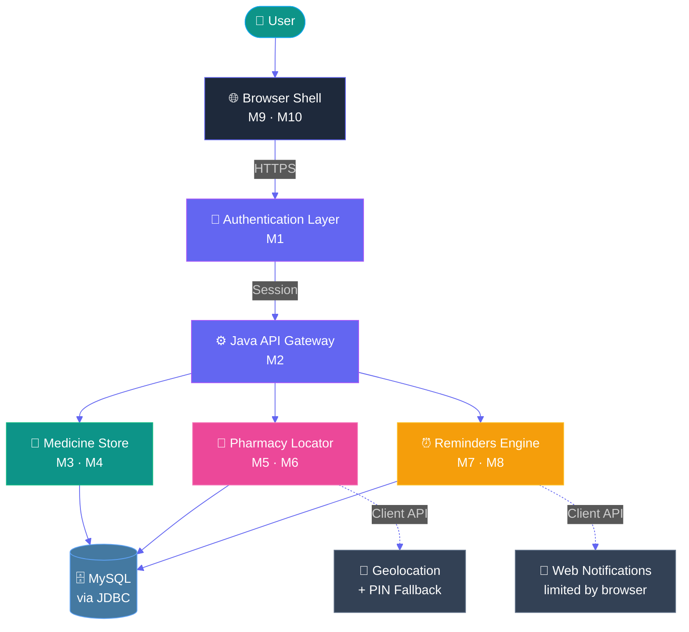
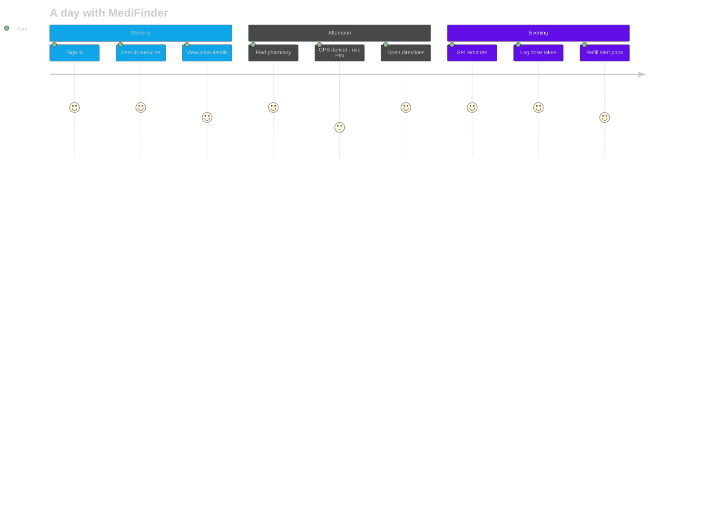
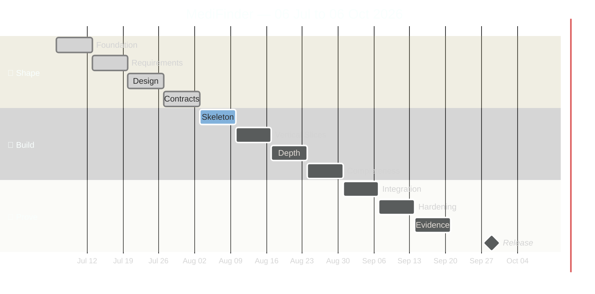
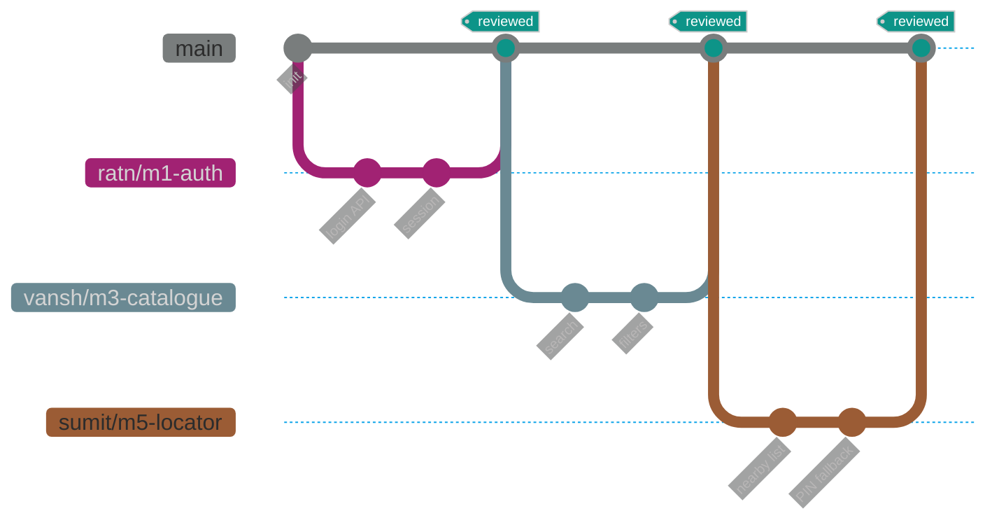

<div align="center">


<p>
  <a href="https://github.com/ratnsharma21/MediFinder">
    
  </a>
  
  
  <a href="https://github.com/ratnsharma21/MediFinder/stargazers">
    
  </a>
</p>

<p>
  
</p>

<br/>

<a href="https://github.com/ratnsharma21/MediFinder">
  
</a>
<a href="#-the-medifinder-story">
  
</a>
<a href="#-tech-arsenal">
  
</a>
<a href="#-the-crew">
  
</a>
<a href="#-12-week-sprint-timeline">
  
</a>

</div>

<br/>

---

## 🌟 The MediFinder Story

<table>
<tr>
<td width="60%" valign="top">

### Why we built this

Three everyday problems. One Monday morning. The same person.

> 🔍 You search for a medicine online — the brand name works but the generic doesn't. Price? Nowhere.  
> 📍 You open a locator — it needs GPS. You deny permission. The app gives up.  
> ⏰ You set a reminder — refresh the page, time is gone. Browser blocked the notification anyway.

**MediFinder** is a Java web application that treats each of these failures as **first-class design decisions**, not afterthoughts.

One login. One workflow. **Search → Locate → Remind → Track.**  
No marketplace tricks. No diagnosis magic. Just honest, working software.

</td>
<td width="40%" valign="top">

<div align="center">

<br/>
<br/>
<br/>
<br/>


<br/><br/>

| 📊 | **At a glance** |
|:---:|---|
| 📅 | 06 Jul → 06 Oct 2026 |
| 👥 | 5 members |
| 🧩 | 10 modules |
| 🗄️ | MySQL + JDBC |
| ☕ | Java backend |

</div>

</td>
</tr>
</table>

---

## ✨ What Makes It Different

<table>
<tr>
<td width="33%" align="center" valign="top">

### 🔐
### Honest Auth
Secure login with session-scoped records across every module. Your reminders, your searches, your data — never leaked between accounts.


</td>
<td width="33%" align="center" valign="top">

### 💊
### Price Provenance
Not just "₹120". We show manufacturer, strength, pack, **MRP vs seller price**, source, and when it was last updated.


</td>
<td width="33%" align="center" valign="top">

### 📍
### GPS-Denied? Fine.
Permission denied is a **designed path**, not an error screen. Switch to PIN or city instantly. Directions still work.


</td>
</tr>
<tr>
<td width="33%" align="center" valign="top">

### ⏰
### Reminders that Persist
Create, edit, delete schedules. Refresh the page — your time **stays exactly where you set it**. One datetime convention, no drift.


</td>
<td width="33%" align="center" valign="top">

### 📝
### Taken / Missed / Skipped
Three honest dose states. Full history per account. Refill thresholds that recalculate the moment you log a dose.


</td>
<td width="33%" align="center" valign="top">

### 🎨
### Prototype-Faithful UI
Dashboard, profile, settings, help — all under one shared visual system. QA evidence baked in, not added later.


</td>
</tr>
</table>

---

## ⚙️ Tech Arsenal

<div align="center">

### Core Stack


<br/><br/>

| Layer | Technology | Purpose |
|:---:|:---:|---|
| ☕ **Backend** |  | Business logic, APIs, authentication |
| 🗄️ **Database** |  | Relational persistence |
| 🔌 **Connectivity** |  | Database access layer |
| 🎨 **Frontend** |   | Prototype-aligned UI |
| 📍 **Location** |  | GPS + PIN fallback |
| 🔔 **Alerts** |  | Browser-native, honest limits |
| 🔀 **VCS** |   | Branch-per-member workflow |

</div>

---

## 🏛️ Architecture

<div align="center">



</div>

### 🧭 Layer Responsibilities

<table>
<tr>
<td width="25%" align="center">

**🖥️ Presentation**  
Prototype-aligned screens for every module

</td>
<td width="25%" align="center">

**⚙️ Application**  
Java APIs, authentication, shared configuration

</td>
<td width="25%" align="center">

**🧠 Domain**  
Catalogue, locator, reminders, logs, alerts

</td>
<td width="25%" align="center">

**🗄️ Data**  
MySQL through JDBC — secrets stay local

</td>
</tr>
</table>

---

## 🔄 User Journey

<div align="center">



</div>

---

## 🧩 Modules — 10 Pieces, 5 Owners

<div align="center">

| ID | Module | Owner | Core Responsibility | Status |
|:---:|---|---|---|:---:|
|  | **🔐 Authentication & Accounts** | Ratn Kumar Sharma | Secure login, authorization, common errors | 🟢 Core |
|  | **⚙️ API / Config / Integration** | Ratn Kumar Sharma | API contracts, integration, code review | 🟢 Core |
|  | **🔍 Medicine Catalogue & Search** | Vansh Oberoi | Search & filter over the medicine store | 🟢 Core |
|  | **💊 Details & Price Provenance** | Vansh Oberoi | MRP vs seller, source, update time | 🟢 Core |
|  | **📍 Pharmacy Locator** | Sumit Kumar Saini | Nearby search, map/list, address/contact | 🟢 Core |
|  | **🧭 Directions & Fallback** | Sumit Kumar Saini | Permission handling, PIN fallback | 🟢 Core |
|  | **⏰ Medicine Reminders** | Sameer Achara | Create/edit/delete schedules | 🟢 Core |
|  | **📝 Dose Logs & Refill Alerts** | Sameer Achara | Taken/missed/skipped, refill warnings | 🟢 Core |
|  | **🎨 Dashboard / Profile / Help** | Sachin Kumawat | Prototype style, guided UI | 🟢 Core |
|  | **🧪 QA / Docs / Demo** | Sachin Kumawat | Checklists, bug reports, screenshots | 🟢 Core |

</div>

---

## 👥 The Crew

<div align="center">

<table>
<tr>
<td align="center" width="20%">


<br/>

**Ratn Kumar Sharma**  
<sub>🚀 Lead · Java Backend</sub>

<br/>


<sub>Auth, APIs, integration, code review</sub>

</td>
<td align="center" width="20%">


<br/>

**Vansh Oberoi**  
<sub>💊 Medicine Store</sub>

<br/>


<sub>Catalogue, search, price provenance</sub>

</td>
<td align="center" width="20%">


<br/>

**Sumit Kumar Saini**  
<sub>📍 Pharmacy Locator</sub>

<br/>


<sub>Nearby search, PIN fallback, directions</sub>

</td>
<td align="center" width="20%">


<br/>

**Sameer Achara**  
<sub>⏰ Reminders Engine</sub>

<br/>


<sub>Schedules, dose logs, refill alerts</sub>

</td>
<td align="center" width="20%">


<br/>

**Sachin Kumawat**  
<sub>🎨 UI/UX · QA · Docs</sub>

<br/>


<sub>Dashboard, QA evidence, documentation</sub>

</td>
</tr>
</table>

</div>

---

## 📅 12-Week Sprint Timeline

<div align="center">



</div>

<br/>

| Week | Window | Phase | Mission |
|:---:|---|---|---|
| 🥇 **1** | 06 – 12 Jul | 🎯 Foundation | Team, scope, abstract, prototype review |
| 📋 **2** | 13 – 19 Jul | 🎯 Requirements | SRS, stories, acceptance criteria |
| 🎨 **3** | 20 – 26 Jul | 🎯 Design | Use-case, activity, class, ER, navigation |
| 📝 **4** | 27 Jul – 02 Aug | 🎯 Contracts | Schema, API contracts, UI mock-ups |
| 🏗️ **5** | 03 – 09 Aug | 🔨 Skeleton | Shared layout, auth foundation, module frames |
| 🧩 **6** | 10 – 16 Aug | 🔨 Slices | Login, search/detail, locator, reminder CRUD |
| 🔍 **7** | 17 – 23 Aug | 🔨 Depth | Filters, PIN fallback, dose logs |
| ✅ **8** | 24 – 30 Aug | 🔨 Completeness | Settings, edges, directions, refills |
| 🔗 **9** | 31 Aug – 06 Sep | 🧪 Integration | Cross-module journey, E2E tests |
| 🛡️ **10** | 07 – 13 Sep | 🧪 Hardening | Security, validation, responsive UI |
| 📸 **11** | 14 – 20 Sep | 🧪 Evidence | System tests, screenshots, documentation |
| 🚀 **12** | 21 Sep – 06 Oct | 🚀 Release | UAT, fixes, candidate, demo, handover |

---

## 📖 Detailed 12-Week Development Log

Academic window: **06 July 2026 → 06 October 2026**

Source planning listed additional late beats (release candidate, regression, final demo). They are **folded into Week 12**, not stretched into extra weeks. College portal numbering wins if it differs.

---

### 🥇 Week 1 — Foundation

<p>
  
  
  
</p>

> **🎯 Objective:** Form the five-member team, freeze module ownership, write the project abstract, and review the prototype so later weeks do not argue about what MediFinder is.

A 10-module Java project fails when ownership is fuzzy. This week makes M1–M10 named, visible and bounded. No feature code is claimed.

**Module scope this week:**

| Area | Work |
|---|---|
| **M1–M2** | Confirm lead role: APIs, auth, integration, review protocol |
| **M3–M4** | Confirm catalogue vs price-provenance boundary |
| **M5–M6** | Confirm nearby search vs GPS-denied fallback as two modules |
| **M7–M8** | Confirm reminder CRUD vs dose logs / refill alerts as two modules |
| **M9–M10** | Confirm prototype-style ownership, QA and documentation lane |

**Daily Progress:**

| Date | Activity | Outcome |
|---|---|---|
| **06 Jul 2026** | Team discussion — availability, interests, academic load | Five-member team agreed in principle |
| **07 Jul 2026** | Module ownership freeze | M1–M10 mapped to the five names above |
| **08 Jul 2026** | Problem shortlisting | Medicine search + pharmacy access + adherence selected as the domain |
| **09 Jul 2026** | Problem research | GPS-denied locators and notification limits recorded as constraints, not extras |
| **10 Jul 2026** | Solution sketch | One-session Java web workflow drafted |
| **11 Jul 2026** | Guide and repository rules | Shared-repo + feature-branch-per-member rule written down |
| **12 Jul 2026** | Abstract and prototype review | Initial abstract prepared; prototype intent reviewed, not implemented |

**Problems Faced:**

- Balancing ten modules across five people without overlapping claims
- Keeping marketplace, diagnosis and guaranteed push **out** of scope
- Agreeing that GPS-denied is a designed path, not a later patch

**Outcomes:**

| Deliverable | Status |
|---|:---:|
| Team and module split | ✅ Done |
| Project abstract | ✅ Done |
| Prototype review | ✅ Done |
| Shared-repo agreement | ✅ Done |
| SRS | 🟡 Planned — Week 2 |

**➡️ Next week:** SRS, user stories, acceptance criteria, data-source research.

---

### 📋 Week 2 — Requirements

<p>
  
  
  
</p>

> **🎯 Objective:** Turn the problem into rules a Java API can implement: SRS, user stories, acceptance criteria and data-source research.

GPS-denied, empty search and notification limits are written as **accepted behaviour**, not stretch goals. Without that, search "works on my sample row", the locator "works if you click Allow", and reminders "work until refresh".

**Module scope this week:**

| Area | Work |
|---|---|
| **M1–M2** | Auth stories: register, login, session, unauthorized access, common API errors |
| **M3–M4** | Search / filter stories; detail fields including MRP vs seller price, source, update time |
| **M5–M6** | Nearby list / map; address / contact; permission denied as a first-class story |
| **M7–M8** | Reminder create / edit / delete; taken / missed / skipped; refill threshold; notification limits |
| **M9–M10** | Dashboard / profile / settings / help stories; evidence format for later QA |

**Daily Progress:**

| Date | Activity | Outcome |
|---|---|---|
| **13 Jul 2026** | Actor and workflow pass | Signed-in user and administrator paths listed |
| **14 Jul 2026** | Store requirements | Search, filter and provenance fields captured |
| **15 Jul 2026** | Locator requirements | GPS-on, GPS-denied, PIN / city, directions, no-result |
| **16 Jul 2026** | Reminder requirements | CRUD, schedules, dose states, refill threshold, notification limits |
| **17 Jul 2026** | Non-functional and security notes | Session, validation, secrets-out-of-Git |
| **18 Jul 2026** | Acceptance criteria | Stories written so they can be tested later |
| **19 Jul 2026** | SRS review | SRS packed for design week |

**Problems Faced:**

- Cutting inventory, payments and clinical advice without leaving holes in the user journey
- Describing browser location and notifications as handled states, not guaranteed services
- Keeping M7/M8 separate from M5/M6 so pharmacy search does not own medication logs

**Outcomes:**

| Deliverable | Status |
|---|:---:|
| SRS | ✅ Done |
| User stories and acceptance criteria | ✅ Done |
| Data-source research | ✅ Done |
| Honest scope cuts | ✅ Done |
| UML | 🟡 Planned — Week 3 |

**➡️ Next week:** Use-case, activity, class and ER diagrams, plus a navigation map.

---

### 🎨 Week 3 — Design

<p>
  
  
  
</p>

> **🎯 Objective:** Draw users, flows, entities and navigation before anyone writes schema-conflicting code.

Locator fallback and reminder persistence both touch session and MySQL. If they invent parallel user models, Week 9 becomes archaeology.

**Module scope this week:**

| Area | Work |
|---|---|
| **M1–M2** | Auth use cases; session as a shared actor on every protected page |
| **M3–M4** | Search → detail activity; provenance fields on the class / ER model |
| **M5–M6** | Locate → permission → results **or** PIN fallback → directions / no-result |
| **M7–M8** | Reminder → schedule → dose log → refill alert sequence |
| **M9–M10** | Navigation map: dashboard, profile, settings, help as chrome around modules |

**Daily Progress:**

| Date | Activity | Outcome |
|---|---|---|
| **20 Jul 2026** | Use-case diagram | User and administrator mapped to M1–M10 |
| **21 Jul 2026** | Activity diagram | Store, locator and reminder flows drawn as one product |
| **22 Jul 2026** | Sequence sketch | UI → Java API → MySQL; location and notification as client steps |
| **23 Jul 2026** | Class diagram | User, pharmacy, reminder, dose log, refill alert, notification preference |
| **24 Jul 2026** | ER draft | Shared user identity across store, locator and reminders |
| **25 Jul 2026** | Navigation map | Protected routes listed under the shared shell |
| **26 Jul 2026** | Design review | Diagrams aligned with the SRS |

**Problems Faced:**

- Permission and notification events are client-side; must not be modelled as guaranteed server services
- Module boundaries vs shared login
- Remaining screens had to sit on the map without inventing extra entities

**Outcomes:**

| Deliverable | Status |
|---|:---:|
| Use-case diagram | ✅ Done |
| Activity diagram | ✅ Done |
| Class diagram | ✅ Done |
| ER diagram | ✅ Done |
| Navigation map | ✅ Done |
| Schema freeze | 🟡 Planned — Week 4 |

**➡️ Next week:** Database schema, API contracts, UI mock-ups.

---

### 📝 Week 4 — Contracts

<p>
  
  
  
</p>

> **🎯 Objective:** Freeze schema, API contracts and UI mock-ups **before** feature code. This is the last cheap week to disagree.

Search filters, PIN fallback payloads, reminder schedules and dose-log status values must be named once.

**Module scope this week:**

| Area | Work |
|---|---|
| **M1–M2** | Auth API contracts; shared error shape; configuration seams |
| **M3–M4** | Catalogue schema; search parameters; detail / provenance fields |
| **M5–M6** | Pharmacy and search-query tables; permission / fallback fields; directions payload |
| **M7–M8** | Reminder / schedule / dose-log / refill tables; datetime convention |
| **M9–M10** | Mock-ups for dashboard, profile, settings, help; visual tokens for shared layout |

**Daily Progress:**

| Date | Activity | Outcome |
|---|---|---|
| **27 Jul 2026** | Entity list from UML | Users, pharmacies, searches, reminders, logs, alerts named |
| **28 Jul 2026** | Relationships and constraints | Account-scoped reminders; pharmacy search history kept separate |
| **29 Jul 2026** | API contract draft | Request / response fields for search, locate, remind |
| **30 Jul 2026** | Store and locator mock-ups | Search, detail, list / map, denied-permission and PIN screens |
| **31 Jul 2026** | Reminder and shell mock-ups | CRUD forms, dose history, dashboard, settings, help |
| **01 Aug 2026** | Datetime convention | One storage / display rule written for reminders |
| **02 Aug 2026** | Contract review | Schema, APIs and mock-ups checked against the SRS |

**Problems Faced:**

- Manual fallback had to be a first-class input, not an afterthought on the map
- Notification limits can be shown in UI; they cannot be designed as guaranteed delivery
- Table naming had to be agreed so five branches would not collide

**Outcomes:**

| Deliverable | Status |
|---|:---:|
| Database schema | ✅ Done |
| API contracts | ✅ Done |
| UI mock-ups | ✅ Done |
| Datetime convention note | ✅ Done |
| Running skeleton | 🟡 Planned — Week 5 |

**➡️ Next week:** Shared layout, auth foundation, catalogue schema in MySQL, module frames.

---

### 🏗️ Week 5 — Skeleton

<p>
  
  
  
</p>

> **🎯 Objective:** Stand up one runnable Java web skeleton: shared chrome, auth foundation, MySQL reachable through JDBC, empty module frames.

Feature work on five branches is useless if the app cannot boot as one system.

**Module scope this week:**

| Area | Work |
|---|---|
| **M1–M2** | Shared layout, auth foundation, JDBC utility, common errors — secrets stay local |
| **M3–M4** | Catalogue schema in MySQL; empty search / detail frames |
| **M5–M6** | Pharmacy tables; empty list / map frames |
| **M7–M8** | Reminder / log tables; empty form frames |
| **M9–M10** | Prototype layout on shared chrome; skeleton dashboard / help pages |

**Daily Progress:**

| Date | Activity | Outcome |
|---|---|---|
| **03 Aug 2026** | Schema implementation | First tables created in MySQL |
| **04 Aug 2026** | Project layout | Common folders for APIs, views, static assets, module ownership |
| **05 Aug 2026** | Server boot | Agreed Java web server started with a test page |
| **06 Aug 2026** | JDBC handshake | Connection utility verified; credentials not committed |
| **07 Aug 2026** | Model / DAO mapping | Store, locator and reminder tables mapped to initial classes |
| **08 Aug 2026** | Empty pages | Search, fallback, reminder and dashboard shells linked from chrome |
| **09 Aug 2026** | Repo hygiene | Feature-branch rule checked; local server files kept untracked |

**Problems Faced:**

- JDBC URL / driver / credential mismatch until local config was aligned
- Shared naming for connection helpers so M3–M8 did not duplicate utilities
- Skeleton pages needed clear "not implemented yet" labels

**Outcomes:**

| Deliverable | Status |
|---|:---:|
| MySQL schema in place | ✅ Done |
| Shared layout | ✅ Done |
| Auth foundation | ✅ Done |
| Module skeletons | ✅ Done |
| Finished login product | 🟡 Planned — Week 6 |

> ⚠️ JDBC connection errors are a **known failure class**. Record them only if they actually happen, then keep secrets out of Git.

**➡️ Next week:** Registration / login, search / detail slice, locator prototype, reminder CRUD.

---

### 🧩 Week 6 — Vertical Slices

<p>
  
  
  
</p>

> **🎯 Objective:** First real path per domain: login, search / detail, locator prototype, reminder CRUD. Still incomplete on purpose.

Depth (filters, PIN fallback, dose logs) is next. Slices first.

**Module scope this week:**

| Area | Work |
|---|---|
| **M1–M2** | Registration / login / logout / session on protected pages |
| **M3–M4** | Search → detail happy path (filters still open) |
| **M5–M6** | Locator prototype against seed data (fallback not finished) |
| **M7–M8** | Reminder create / edit / delete for the logged-in user |
| **M9–M10** | Navigation to the new slices without breaking prototype chrome |

**Daily Progress:**

| Date | Activity | Outcome |
|---|---|---|
| **10 Aug 2026** | Registration | New accounts stored through JDBC |
| **11 Aug 2026** | Login | Credential check and error messages for invalid login |
| **12 Aug 2026** | Session | Login creates session; logout invalidates it |
| **13 Aug 2026** | Search / detail slice | Catalogue happy path wired UI → API → MySQL |
| **14 Aug 2026** | Locator prototype | Nearby list / map against seed rows |
| **15 Aug 2026** | Reminder CRUD | Add / edit / delete persisted per session user |
| **16 Aug 2026** | Slice review | Protected navigation checked; unfinished paths labelled |

**Problems Faced:**

- Back-button after logout still showing protected pages until cache/session handling was corrected
- Locator prototype looked "done" if GPS was never denied — fallback stayed explicitly unfinished
- Reminder edit / delete had to reject records that did not belong to the session user

**Outcomes:**

| Deliverable | Status |
|---|:---:|
| Registration / login / session | ✅ Done |
| Search / detail slice | ✅ Done |
| Locator prototype | ✅ Done |
| Reminder CRUD slice | ✅ Done |
| Filters, PIN fallback, dose logs | 🟡 Planned — Week 7 |

**➡️ Next week:** UI / API integration, search filters, PIN fallback, dose logs.

---

### 🔍 Week 7 — Depth

<p>
  
  
  
</p>

> **🎯 Objective:** Make the slices survive messy input: filters, PIN fallback, dose logs.

**Module scope this week:**

| Area | Work |
|---|---|
| **M1–M2** | Integration review; shared error responses for bad payloads |
| **M3–M4** | Search filters; case-insensitive / field mapping; empty-query response |
| **M5–M6** | Manual PIN / city fallback when GPS is denied or unavailable |
| **M7–M8** | Taken / missed / skipped dose logs against reminder records |
| **M9–M10** | Loading / empty / error presentation consistent with the prototype |

**Daily Progress:**

| Date | Activity | Outcome |
|---|---|---|
| **17 Aug 2026** | Filter UI | Catalogue filter controls added to the search page |
| **18 Aug 2026** | Filter API | Query mapping aligned between UI and backend fields |
| **19 Aug 2026** | Empty search | Empty-query and no-hit responses made explicit |
| **20 Aug 2026** | PIN fallback | Manual PIN / city path after denied or missing GPS |
| **21 Aug 2026** | Dose logs | Taken / missed / skipped saved against the reminder |
| **22 Aug 2026** | Shared error copy | Empty / loading / error states aligned in chrome |
| **23 Aug 2026** | Depth review | Denied GPS and empty search no longer dead-end |

**Problems Faced:**

- Brand vs generic matching broke when case and field names disagreed
- PIN search and GPS search needed one clean input path
- Parallel commits collided on shared layout files

**Outcomes:**

| Deliverable | Status |
|---|:---:|
| UI / API integration on live slices | ✅ Done |
| Catalogue filters | ✅ Done |
| PIN fallback path | ✅ Done |
| Dose-log states | ✅ Done |
| Directions, refill rules, settings | 🟡 Planned — Week 8 |

> ⚠️ Wrong or empty search results from inconsistent fields are a **known failure class**. Standardise mapping, add empty-query behaviour, retest.

**➡️ Next week:** Profile / settings, catalogue edge cases, directions, refill rules.

---

### ✅ Week 8 — Completeness

<p>
  
  
  
</p>

> **🎯 Objective:** Close owned edges so Week 9 can integrate instead of inventing leftover screens.

**Module scope this week:**

| Area | Work |
|---|---|
| **M1–M2** | Auth and API hardening around profile / settings calls |
| **M3–M4** | Catalogue edge cases: no hit, partial name, brand vs generic |
| **M5–M6** | Directions from a selected pharmacy; no-result copy; permission-denied message |
| **M7–M8** | Refill-threshold rules; notification permission and limitation messaging |
| **M9–M10** | Profile / settings / help in prototype style |

**Daily Progress:**

| Date | Activity | Outcome |
|---|---|---|
| **24 Aug 2026** | Permission copy | Denied-location message on the locator |
| **25 Aug 2026** | Directions | Link from pharmacy details using stored address |
| **26 Aug 2026** | No-result state | Dedicated empty pharmacy result view |
| **27 Aug 2026** | Catalogue edges | Partial name, no hit, brand / generic cases checked |
| **28 Aug 2026** | Refill rules | Threshold compared against reminder / log data |
| **29 Aug 2026** | Notifications | Permission prompt plus limitation text — no delivery promise |
| **30 Aug 2026** | Profile / settings | Account pages in shared chrome; leftover placeholders removed |

**Problems Faced:**

- Incomplete pharmacy addresses produced unusable direction targets
- Browser notifications blocked or ignored — UI had to explain limits
- Empty or zero refill thresholds produced incorrect alerts until validated

**Outcomes:**

| Deliverable | Status |
|---|:---:|
| Profile / settings / help | ✅ Done |
| Catalogue edge cases | ✅ Done |
| Directions and no-result | ✅ Done |
| Refill rules and notification-limit copy | ✅ Done |
| Cross-module E2E | 🟡 Planned — Week 9 |

**➡️ Next week:** One journey across ten modules; end-to-end tests; defect list.

---

### 🔗 Week 9 — Integration

<p>
  
  
  
</p>

> **🎯 Objective:** One journey across ten modules. Session, MySQL and chrome must survive the hand-offs.

Separately "done" modules still collide on session keys, shared CSS and user-id foreign keys.

**Module scope this week:**

| Area | Work |
|---|---|
| **M1–M2** | Cross-module session; API error consistency; merge review |
| **M3–M4** | Search / detail inside the full journey, not a standalone page |
| **M5–M6** | GPS-allowed **and** GPS-denied journeys in the same session |
| **M7–M8** | Reminder + dose log + refill after a store / locator visit |
| **M9–M10** | E2E script, checklists, first bug list — no invented pass rates |

**Daily Progress:**

| Date | Activity | Outcome |
|---|---|---|
| **31 Aug 2026** | Journey wiring | Login → store → locator → reminders without re-auth |
| **01 Sep 2026** | Store in E2E | Hit, miss and filter cases inside the shell |
| **02 Sep 2026** | Locator in E2E | Allowed GPS, denied GPS, invalid PIN, no-result |
| **03 Sep 2026** | Reminders in E2E | CRUD, three dose states, refill threshold |
| **04 Sep 2026** | Error handling | Invalid session, missing IDs, JDBC failure copy |
| **05 Sep 2026** | Session isolation | Reminder rows stay account-scoped; search does not overwrite session keys |
| **06 Sep 2026** | Defect list | Open issues handed to Week 10 — not hidden |

**Problems Faced:**

- Permission-denied still looked like "searching" until fallback timeout was explicit
- No-result and JDBC-error states were easy to confuse
- Refill alerts did not always recalculate after a log update

**Outcomes:**

| Deliverable | Status |
|---|:---:|
| Integrated navigation | ✅ Done |
| End-to-end happy path | ✅ Done |
| GPS-denied path in E2E | ✅ Done |
| Defect list | ✅ Done |
| Defect closure | 🟡 Planned — Week 10 |

> ⚠️ Locator failure when GPS is denied is a **known failure class**. Fallback must already exist; this week proves it inside E2E.

**➡️ Next week:** Security, validation, responsive UI, error-state fixes, regression.

---

### 🛡️ Week 10 — Hardening

<p>
  
  
  
</p>

> **🎯 Objective:** Make failure states first-class: security, validation, responsive UI, error-state fixes.

Reminder datetime drift after refresh is a named risk.

**Module scope this week:**

| Area | Work |
|---|---|
| **M1–M2** | Authz on every write; validation; safer error reporting; JDBC hygiene |
| **M3–M4** | Query / filter validation; empty / error / loading at smaller widths |
| **M5–M6** | Invalid PIN, no-result, denied permission — copy and layout pass |
| **M7–M8** | Consistent date/time parse; refill recalculation after a log |
| **M9–M10** | Responsive chrome; visual check against prototype |

**Daily Progress:**

| Date | Activity | Outcome |
|---|---|---|
| **07 Sep 2026** | Reproduce Week 9 defects | Outstanding issues confirmed on a clean session |
| **08 Sep 2026** | Locator fixes | Fallback timing, invalid PIN, directions from incomplete addresses |
| **09 Sep 2026** | Reminder fixes | Ownership checks, log updates, refill refresh, datetime parse |
| **10 Sep 2026** | Validation | Required fields, threshold values, search input rules |
| **11 Sep 2026** | Responsive pass | Catalogue, locator, reminder and dashboard at multiple widths |
| **12 Sep 2026** | Regression | Week 9 journeys re-run after the fixes |
| **13 Sep 2026** | Priority close | High-priority defects closed or explicitly deferred |

**Problems Faced:**

- CSS changes reintroduced locator layout bugs — needed a second regression pass
- Refill recalculation was date-sensitive and needed query correction, not UI-only tweaks
- Cached assets made it hard to confirm a fix had actually deployed

**Outcomes:**

| Deliverable | Status |
|---|:---:|
| Security / validation pass | ✅ Done |
| Responsive UI pass | ✅ Done |
| Error-state fixes | ✅ Done |
| Regression on Week 9 journeys | ✅ Done |
| Evidence pack | 🟡 Planned — Week 11 |

> ⚠️ Reminder time changing after refresh is a **known failure class**. Lock one datetime convention and retest create / edit / refresh / repeat.

**➡️ Next week:** System tests, screenshots, documentation that matches the running app.

---

### 📸 Week 11 — Evidence

<p>
  
  
  
</p>

> **🎯 Objective:** Prove behaviour. System tests, screenshots, documentation that matches the running app. Feature scope freezes.

Evaluators should not have to imagine GPS-denied or refill-limit screens.

**Module scope this week:**

| Area | Work |
|---|---|
| **M1–M2** | Auth evidence: valid / invalid credentials, session expiry |
| **M3–M4** | Search hit / miss / filter; provenance fields visible |
| **M5–M6** | Allowed GPS, denied GPS, invalid PIN, directions, no-result |
| **M7–M8** | CRUD, three dose states, refill threshold, notification-limit messaging |
| **M9–M10** | Checklists, bug reports, screenshot pack, README alignment, repo hygiene |

**Daily Progress:**

| Date | Activity | Outcome |
|---|---|---|
| **14 Sep 2026** | Final functional pass | Auth + M3–M8 retested on the hardened build |
| **15 Sep 2026** | Screenshot capture | Slots filled under `docs/screenshots/` as files exist |
| **16 Sep 2026** | Module notes | Implementation notes written only for work that exists |
| **17 Sep 2026** | GitHub organisation | Folders cleaned; local server / secret files untracked |
| **18 Sep 2026** | Code cleanup | Unused placeholders and duplicate helpers removed |
| **19 Sep 2026** | README vs product | Docs stripped of screens that were never built |
| **20 Sep 2026** | Evidence review | Gaps listed for Week 12, not invented as completed |

**Problems Faced:**

- Older labels still appearing in screenshots — recapture required
- Cleanup in shared layout risked another member's page
- Browser permission dialogs are hard to capture consistently

**Outcomes:**

| Deliverable | Status |
|---|:---:|
| System test notes | ✅ Done |
| Screenshot / evidence pack | ✅ Done |
| Documentation updates | ✅ Done |
| Repo hygiene | ✅ Done |
| UAT and handover | 🟡 Planned — Week 12 |

**➡️ Next week:** UAT, last fixes, release candidate, demo, handover — still inside 06 October 2026.

---

### 🚀 Week 12 — Release

<p>
  
  
  
</p>

> **🎯 Objective:** User acceptance against stories and prototype style, last bug fixes, candidate build, final README, demo and handover. **No thirteenth week.**

Source planning listed extra late-September / October beats. They are compressed here, not extended past 06 Oct 2026.

**Three sub-windows:**

| Window | Focus |
|---|---|
| **21 – 27 Sep** | UAT, bug fixes, deployment preparation |
| **28 Sep – 04 Oct** | Release candidate, README / report freeze, demo script |
| **05 – 06 Oct** | Final regression, repository evidence, handover |

**Module scope this week:**

| Area | Work |
|---|---|
| **M1–M2** | Candidate build, config notes, no secrets in Git, merge discipline |
| **M3–M4** | UAT on search / detail / provenance |
| **M5–M6** | UAT on GPS-on, GPS-off, directions |
| **M7–M8** | UAT on schedules, logs, refill, notification limits |
| **M9–M10** | Demo rehearsal, visual check vs prototype, final docs |

**Daily Progress:**

| Date | Activity | Outcome |
|---|---|---|
| **21 Sep 2026** | UAT start | Candidate build; first full login-to-modules walkthrough |
| **22 Sep 2026** | Store UAT | Search, filters, details, provenance |
| **23 Sep 2026** | Locator UAT | GPS on / off, PIN, directions, no-result |
| **24 Sep 2026** | Reminder UAT | CRUD, dose states, refill, notification-limit copy |
| **25 Sep 2026** | Shell UAT | Dashboard, profile, settings, help vs prototype |
| **26 Sep 2026** | Bug-fix pass | Only demo-blocking issues; no new modules |
| **27 Sep 2026** | Deploy notes | Local run / JDBC notes prepared — secrets still local |
| **28 Sep 2026** | README freeze | Week log and module claims match the running app |
| **29 Sep 2026** | Repo review | Repository checked for source, evidence, ignored files |
| **30 Sep 2026** | Demo script | One path, one owner per screen |
| **01 Oct 2026** | Screenshot recapture | Any pre-fix labels replaced |
| **02 Oct 2026** | Feature freeze | Only critical demo blockers allowed |
| **03 Oct 2026** | Freeze verification | Auth + M3–M10 rechecked on the frozen build |
| **04 Oct 2026** | Report alignment | Weekly reports and demo script agree with this README |
| **05 Oct 2026** | Final polish | Image paths, diagram rendering, repository cleanliness |
| **06 Oct 2026** | Handover | Submission pack closed at the end of the academic window |

**Problems Faced:**

- Small copy mismatches between fallback UI and README
- A late reminder-date issue had to be fixed without reopening scope
- Coordinating one demo script across five members

**Outcomes:**

| Deliverable | Status |
|---|:---:|
| UAT notes | ✅ Done |
| Final bug-fix pass | ✅ Done |
| Release candidate | ✅ Done |
| Final README and evidence | ✅ Done |
| Demo / handover pack | ✅ Done |

> 🎉 **After Week 12:** Submit the repository, demonstrate each owner's modules, and stop. If a week had no major error, say so honestly.

---

## 🔀 GitHub Workflow

<div align="center">



</div>

<br/>

| Rule | Practice |
|:---|:---|
| 🏛️ **One repo** | All five members ship in the same project |
| 🌿 **Branch per member** | Feature work stays isolated until reviewed |
| 📝 **Small commits** | Messages describe the change — not "update" |
| 🔍 **PR before main** | Review, then merge |
| 📊 **Weekly evidence** | Report includes repository + that week's PR/commit links |
| 🚫 **No fiction** | Commits, issues, errors recorded only when they exist |

```text
Repository : https://github.com/ratnsharma21/MediFinder
Demo       : not published yet
Deployment : not published yet
```

---

## 🧪 Testing & Quality

<table>
<tr>
<td width="50%" valign="top">

### 📋 Test Layers

| Layer | Owner |
|---|---|
| 🧩 Functional / module | Module owners |
| 🔗 Integration | M1/M2 + owners |
| 🎯 Edge cases | M3–M8 + M10 |
| 🚀 System / E2E | Whole team |
| 🔁 Regression | M10 + owners |
| ✅ UAT | Week 12 · M9/M10 |
| 📸 Evidence | M10 |

</td>
<td width="50%" valign="top">

### ⚠️ Known Failure Classes

- 🔌 MySQL / JDBC connection mismatch
- 🔍 Search returning wrong rows from case/field inconsistency
- 📍 Locator unusable when GPS permission denied
- ⏰ Reminder time shifting after refresh
- 🎨 Merge conflicts on shared CSS breaking dashboard

> If a week had no major error, **say so**. Don't invent one.

</td>
</tr>
</table>

---

## 🚀 Getting Started

<div align="center">


</div>

<br/>

```bash
# 1️⃣  Clone the repository
git clone https://github.com/ratnsharma21/MediFinder.git
cd MediFinder

# 2️⃣  Set up MySQL database
mysql -u root -p < db/schema.sql

# 3️⃣  Configure JDBC (keep this LOCAL, never commit)
cp config/db.properties.example config/db.properties
# edit config/db.properties with your credentials

# 4️⃣  Build & run
# Use the team's agreed server setup (Tomcat / embedded)

# 5️⃣  Open in browser
# http://localhost:8080/MediFinder
```

> 💡 **Pro tip:** Always work on your assigned feature branch (`your-name/mX-feature`) and open a PR for review before merging into `main`.

---

## 📸 Screenshots

> 📷 Screenshots will land in `docs/screenshots/` as modules reach their evidence milestone (Week 11). These are **placeholder slots**.

<table>
<tr>
<td align="center" width="33%">


<sub>**🔐 Authentication** · M1</sub>

</td>
<td align="center" width="33%">


<sub>**🔍 Medicine Search** · M3</sub>

</td>
<td align="center" width="33%">


<sub>**💊 Price Provenance** · M4</sub>

</td>
</tr>
<tr>
<td align="center">


<sub>**📍 Pharmacy Locator** · M5</sub>

</td>
<td align="center">


<sub>**🧭 PIN Fallback** · M6</sub>

</td>
<td align="center">


<sub>**⏰ Reminder Form** · M7</sub>

</td>
</tr>
<tr>
<td align="center">


<sub>**📝 Dose Log** · M8</sub>

</td>
<td align="center">


<sub>**🎨 Dashboard** · M9</sub>

</td>
<td align="center">


<sub>**🧪 QA Evidence** · M10</sub>

</td>
</tr>
</table>

---

## 🤝 Working Agreements

<table>
<tr>
<td width="50%" valign="top">

### 🌿 Branch Discipline
- Feature branch per member
- Review before merge to `main`
- Small, descriptive commits
- Shared CSS has a clear owner

</td>
<td width="50%" valign="top">

### 🎯 Scope Discipline
- GPS denied, empty search, blocked notifications are **expected test cases**
- Sachin leads guided UI, QA, docs
- Sameer owns **M7 & M8 only**
- College portal week numbering wins if different

</td>
</tr>
</table>

---

## 📊 Project Pulse

<div align="center">

<a href="https://github.com/ratnsharma21/MediFinder">
  
</a>

<br/><br/>

<a href="https://github.com/ratnsharma21/MediFinder/graphs/contributors">
  
</a>
<a href="https://github.com/ratnsharma21/MediFinder/commits/main">
  
</a>
<a href="https://github.com/ratnsharma21/MediFinder/issues">
  
</a>
<a href="https://github.com/ratnsharma21/MediFinder/pulls">
  
</a>

</div>

---

<div align="center">


<sub>**06 July 2026 → 06 October 2026** · 5 members · 10 modules · one repository · zero fiction</sub>

<br/><br/>

<a href="https://github.com/ratnsharma21/MediFinder">
  
</a>
<a href="https://github.com/ratnsharma21/MediFinder/fork">
  
</a>
<a href="https://github.com/ratnsharma21/MediFinder/issues/new">
  
</a>

</div>
