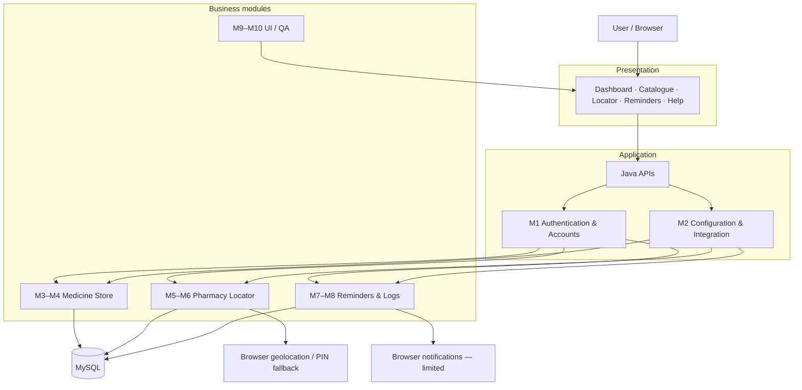
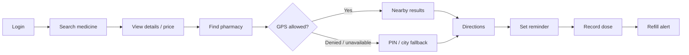
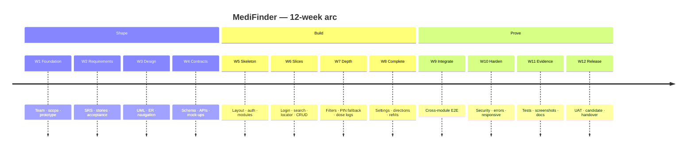
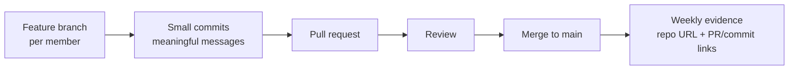

# MediFinder

<p align="center">
  
</p>

<h3 align="center"><em>Find the medicine. Reach the pharmacy. Stay on the dose.</em></h3>

<p align="center">
  MediFinder is a Java web platform that unifies <strong>medicine discovery</strong>, <strong>nearby pharmacy access</strong>, and <strong>personal medication adherence</strong> into one account-aware workflow — including location fallback when GPS is denied, and reminder behaviour that respects browser notification limits.
</p>

<p align="center">
  
  
  
  
  
</p>

<p align="center">
  <a href="[ADD REPOSITORY LINK]"><strong>Repository</strong></a> ·
  <a href="[ADD DEMO LINK]"><strong>Live Demo</strong></a> ·
  <a href="[ADD DEPLOYMENT LINK]"><strong>Deployment</strong></a> ·
  <a href="#-12-week-development-roadmap"><strong>12-Week Roadmap</strong></a> ·
  <a href="#-team--module-ownership"><strong>Team</strong></a>
</p>

---

## 📌 Project at a Glance

<table>
  <tr>
    <td width="50%">

**What it is**  
A five-member Java web system for medicine catalogue search, pharmacy locator with PIN fallback, dose reminders, and guided UI / QA.

**Why it exists**  
Medicine lookup, nearby pharmacy access, and medication follow-up are usually split across disconnected tools — and they fail when location or notifications are blocked.

    </td>
    <td width="50%">

| | |
|---|---|
| **Type** | Java web application |
| **Duration** | 06 July 2026 – 06 October 2026 |
| **Team** | 5 members · 10 modules |
| **Persistence** | MySQL via JDBC |
| **Access** | Account-based (M1) |
| **Status** | Academic build · evidence-driven |

    </td>
  </tr>
</table>

> MediFinder is not a pharmacy marketplace, a clinical diagnosis engine, or a guaranteed push-notification service. It is a coordinated web workflow for **search → details → locate → remind → log**.

---

## 🎯 Problem Statement

People managing everyday medication face three separate failures — often on the same day.

**1. Medicine information is fragmented.**  
Brand names, generic names, strength, pack size, manufacturer, MRP versus seller price, and “when was this price last updated?” rarely live in one trustworthy view. Search that is case-sensitive or field-inconsistent returns empty or wrong results.

**2. Nearby help depends on a permission the browser can deny.**  
A pharmacy locator that only works with GPS coordinates is unusable when location is blocked, unavailable, or inaccurate. Users still need a **manual PIN / city fallback**, a clear permission-denied state, and directions that do not pretend GPS succeeded.

**3. Adherence tools forget the real world.**  
Reminders must be created, edited and deleted; doses are taken, missed or skipped; refills have thresholds; and **browser notifications have limits**. A reminder that shows a different time after refresh is worse than no reminder.

MediFinder addresses these as one product: authenticated access, catalogue + price provenance, pharmacy locator with fallback, reminder/dose/refill flows, and a consistent dashboard / help / QA layer so the five modules feel like a single system.

---

## 💡 Solution

MediFinder connects ten owned modules behind one shared repository and one user session.

```text
User
  →  Authentication & accounts
  →  Medicine catalogue / search
  →  Medicine details & price provenance
  →  Nearby pharmacy locator
  →  Directions / PIN fallback
  →  Medicine reminders
  →  Dose logs & refill alerts
  →  Dashboard / profile / settings / help
```

| Layer | What the user gets |
|---|---|
| **Identity** | Secure login, authorization, and account-scoped data |
| **Discovery** | Search/filter medicines; inspect manufacturer, strength, pack, MRP vs seller price, source and update time |
| **Access** | Nearby pharmacy list/map, address & contact, GPS permission handling, manual PIN fallback, directions |
| **Adherence** | Reminder CRUD, schedules, taken / missed / skipped logs, refill warnings, notification-limitation messaging |
| **Experience** | Prototype-faithful UI, dashboard, profile, settings, help, QA evidence and demo support |

---

## ✨ Key Features

<table>
<tr>
<td width="33%" valign="top">

### 🔐 Authentication
Account registration and login, authorization around module pages, and common API error handling so every other module has a reliable user context.

</td>
<td width="33%" valign="top">

### 💊 Medicine Discovery
Catalogue search and filters across brand/generic naming, with explicit empty, loading and error states instead of silent failures.

</td>
<td width="33%" valign="top">

### 🏷️ Price Provenance
Medicine detail views surface manufacturer, strength, pack, **MRP vs seller price**, source, and last update time.

</td>
</tr>
<tr>
<td width="33%" valign="top">

### 🏪 Pharmacy Locator
Nearby pharmacy search as map/list, with address and contact details for a selected result.

</td>
<td width="33%" valign="top">

### 📍 Location & Directions
Browser location permission as a first-class state. If GPS is denied or unavailable: **manual PIN / city fallback**, permission-denied copy, directions links, and no-result handling.

</td>
<td width="33%" valign="top">

### ⏰ Medicine Reminders
Create, edit and delete reminder schedules — including dose instructions — persisted per account.

</td>
</tr>
<tr>
<td width="33%" valign="top">

### 📋 Dose Tracking
Log doses as **taken**, **missed**, or **skipped**, and keep history attached to the logged-in user.

</td>
<td width="33%" valign="top">

### 🔔 Refill Alerts
Threshold-based refill warnings, plus honest handling of **browser notification permission and limitations**.

</td>
<td width="33%" valign="top">

### 👤 Profile & QA
Dashboard, profile, settings and help, guided UI support, test checklists, bug reports, screenshots, README and demo evidence.

</td>
</tr>
</table>

---

## 🧩 System Modules

Ten modules. Five owners. One repository.

| ID | Module | Owner | Purpose |
|:---:|---|---|---|
| **M1** | Authentication & Accounts | Ratn Kumar Sharma | Java APIs, secure login, authorization, common errors |
| **M2** | API / Configuration / Integration | Ratn Kumar Sharma | API contracts, configuration, integration and code review |
| **M3** | Medicine Catalogue & Search | Vansh Oberoi | Search/filter over the medicine store |
| **M4** | Medicine Details & Price Provenance | Vansh Oberoi | Details, manufacturer/strength/pack, MRP vs seller price, source & update time |
| **M5** | Pharmacy Locator | Sumit Kumar Saini | Nearby pharmacy search, map/list, address/contact |
| **M6** | Directions & Location Fallback | Sumit Kumar Saini | Permission handling, manual PIN fallback, directions, no-result states |
| **M7** | Medicine Reminders | Sameer Achara | Create / edit / delete schedules and reminder forms |
| **M8** | Dose Logs & Refill Alerts | Sameer Achara | Taken / missed / skipped logs, refill warnings, notification limitations |
| **M9** | Dashboard / Profile / Settings / Help | Sachin Kumawat | Preserve prototype style, guided UI, account-facing pages |
| **M10** | QA / Documentation / Demo | Sachin Kumawat | Test checklists, bug reports, screenshots, README and report |

<details>
<summary><strong>Module responsibility map</strong></summary>

<br/>

| Owner | Coding load | Modules | Responsibility (as assigned) |
|---|---|---|---|
| **Ratn Kumar Sharma** | High | M1 · M2 | Java APIs, secure login, authorization, common errors, code reviews and integration |
| **Vansh Oberoi** | High | M3 · M4 | Search/filter, medicine details, manufacturer/strength/pack, MRP vs seller price, source and update time |
| **Sumit Kumar Saini** | Medium–High | M5 · M6 | Nearby pharmacy search, map/list, address/contact, permission handling and manual PIN fallback |
| **Sameer Achara** | Medium | M7 · M8 | Create/edit/delete schedules, taken/missed/skipped logs, refill warnings and notification limitations |
| **Sachin Kumawat** | Low–Medium | M9 · M10 | Preserve prototype style, guided UI support, test checklists, bug reports, screenshots, README and report |

Sachin Kumawat carries **lighter coding responsibility** and more testing, documentation and guided UI work. All work is expected to be evidenced in the shared repository.

</details>

---

## 🏗️ System Architecture

Conceptual architecture from the assigned stack: **Java APIs**, **MySQL**, browser location, and browser notifications. Components not specified by the project plan are not shown as if they exist.



| Layer | Role |
|---|---|
| **Presentation** | Prototype-aligned screens for search, details, locator, reminders, dashboard, profile, settings and help |
| **Application** | Java APIs, secure login, authorization, shared configuration and integration seams |
| **Business modules** | Catalogue, price provenance, pharmacy locator, directions/fallback, reminders, dose logs, refill alerts |
| **Data** | MySQL persistence through the backend data access path (JDBC) |
| **Browser services** | Geolocation and notifications are **client capabilities**, not guaranteed server features |

---

## 🔄 User Journey



1. Sign in through **M1** so later records stay account-scoped.  
2. Search and filter the catalogue (**M3**), then open details with price provenance (**M4**).  
3. Locate a nearby pharmacy (**M5**). If permission is denied, continue through **M6** fallback.  
4. Create a reminder (**M7**), log taken / missed / skipped doses, and follow refill warnings (**M8**).  
5. Use dashboard, profile, settings and help (**M9**) under the same visual system (**M10**).

---

## 👥 Team & Module Ownership

<p align="center"><em>One shared repository · one feature branch per member · review before merge to main</em></p>

<table>
<tr>
<td width="20%" valign="top">

**Ratn Kumar Sharma**  
Java Backend / Lead  

`M1` Authentication & Accounts  
`M2` API / Configuration / Integration  

APIs, secure login, authorization, common errors, reviews, integration.

</td>
<td width="20%" valign="top">

**Vansh Oberoi**  
Medicine Store  

`M3` Catalogue & Search  
`M4` Details & Price Provenance  

Search/filter, manufacturer, strength, pack, MRP vs seller price, source, update time.

</td>
<td width="20%" valign="top">

**Sumit Kumar Saini**  
Pharmacy Locator  

`M5` Pharmacy Locator  
`M6` Directions & Location Fallback  

Nearby search, map/list, address/contact, GPS permission, manual PIN fallback.

</td>
<td width="20%" valign="top">

**Sameer Achara**  
Reminders / Notifications  

`M7` Medicine Reminders  
`M8` Dose Logs & Refill Alerts  

Schedule CRUD, taken/missed/skipped logs, refill warnings, notification limitations.

</td>
<td width="20%" valign="top">

**Sachin Kumawat**  
UI/UX, QA & Docs  

`M9` Dashboard / Profile / Settings / Help  
`M10` QA / Documentation / Demo  

Prototype style, guided UI, checklists, bug reports, screenshots, README.

</td>
</tr>
</table>

---

## 🗓️ 12-Week Development Roadmap

Academic window: **06 July 2026 → 06 October 2026**.  
Source milestones are presented as a **12-phase engineering journey** (not a 14-week copy).

| Week | Dates | Phase | Objective | Key deliverables |
|:---:|---|---|---|---|
| **01** | 06–12 Jul | Foundation | Form the team, freeze scope, review prototype intent | Team ownership, abstract, module split, prototype review |
| **02** | 13–19 Jul | Requirements | Turn the problem into implementable rules | SRS, user stories, acceptance criteria, data-source research |
| **03** | 20–26 Jul | Design | Model users, flows and navigation | Use-case / activity / class / ER diagrams, navigation map |
| **04** | 27 Jul–02 Aug | Contracts | Make UI, data and APIs agree before code | Database schema, API contracts, UI mock-ups |
| **05** | 03–09 Aug | Skeleton | Stand up the shared application | Shared layout, auth foundation, catalogue schema, module skeletons |
| **06** | 10–16 Aug | Vertical slices | First working paths per domain | Registration/login, search/detail, locator prototype, reminder CRUD |
| **07** | 17–23 Aug | Module depth | Connect UI to APIs and handle real inputs | UI/API integration, search filters, PIN fallback, dose logs |
| **08** | 24–30 Aug | Completeness | Close owned feature edges | Profile/settings, catalogue edge cases, directions, refill rules |
| **09** | 31 Aug–06 Sep | Integration | One journey across ten modules | Module integration, end-to-end tests |
| **10** | 07–13 Sep | Hardening | Make failure states first-class | Security, validation, responsive UI, error-state fixes |
| **11** | 14–20 Sep | Evidence | Prove behaviour, not just screens | System tests, test evidence, documentation updates |
| **12** | 21 Sep–06 Oct | Release | UAT, fixes, README, submission pack | UAT, bug fixes, release candidate, final docs / demo prep |



---

## 🔀 GitHub Workflow

The team uses **one shared repository** and **a separate feature branch per member**.



| Rule | Practice |
|---|---|
| **One repo** | All five members push to the same project |
| **Branch per member** | Feature work stays isolated until reviewed |
| **Small commits** | Messages describe the change, not “update” |
| **PR before main** | Review, then merge. If a PR is not merged, its status is stated honestly |
| **Weekly evidence** | Each weekly report includes `[REPOSITORY URL]` plus that week’s actual `[PR LINK]` / `[COMMIT LINK]` |
| **No fiction** | Commits, issues, errors and results are recorded only when they exist |

**Why this workflow:** ten modules share layout, session and MySQL. Isolated branches plus review catch CSS/merge collisions, API contract drift, and “it works on my machine” JDBC config before they reach `main`.

Placeholders for evidence (replace with real links; do not invent them):

```text
Repository : [REPOSITORY URL]
This week  : [PR LINK]   ·   [COMMIT LINK]
Demo       : [ADD DEMO LINK]
```

---

## 🧪 Testing & Quality

Quality is planned across the roadmap (Weeks 9–12 especially). This section describes **the test types the project is built to run** — not fabricated pass rates.

| Layer | What is exercised | Typical owners |
|---|---|---|
| **Functional / module** | Auth, catalogue search, details, locator, reminders, dose logs, dashboard pages | Module owners |
| **Integration** | UI ↔ Java API ↔ MySQL; shared session across M3–M8 | M1/M2 + module owners |
| **Edge cases** | Empty search, GPS denied, invalid PIN, no pharmacy results, blocked notifications, reminder time after refresh | M3–M8 + M10 |
| **System / E2E** | Login → search → details → locate → remind → log → refill | Whole team |
| **Regression** | Re-run happy paths after CSS/API/schema fixes | M10 + owners |
| **UAT** | Walkthrough against acceptance criteria and prototype style | Week 12 · M9/M10 |
| **Evidence** | Checklists, bug reports, screenshots, README | M10 |

**Failure classes the plan treats as normal (not as claimed incidents):**

- MySQL / JDBC connection and configuration mismatch  
- Search returning wrong or empty results because of case/field inconsistency  
- Locator unusable when GPS permission is denied  
- Reminder time shifting after refresh (parse / timezone)  
- Merge conflicts on shared CSS breaking dashboard layout  

Fixes are documented only when they actually happen, with diagnosis → team discussion → fix → retest → prevention.

---

## 📊 Project Development / Progress

A product arc — distinct from the weekly table.

```text
 Idea
  │  Medicine search, pharmacy access, and adherence in one web product
  ▼
 Requirements
  │  SRS, user stories, acceptance criteria, data-source research
  ▼
 Design
  │  Use-case / activity / class / ER diagrams, navigation map
  ▼
 Contracts
  │  Schema, API contracts, UI mock-ups
  ▼
 Module development
  │  Auth · catalogue · locator · reminders · dashboard
  ▼
 Integration
  │  Shared layout, session, MySQL, cross-module journeys
  ▼
 Testing
  │  Module, integration, edge cases, system tests
  ▼
 UAT
  │  Acceptance against prototype and stories
  ▼
 Release candidate
  │  Bug fixes, docs, evidence pack
  ▼
 Final demo
     Repository, contribution evidence, handover
```

| Gate | Meaning |
|---|---|
| **Contracts before code** | Schema + API + mock-ups freeze in Week 4 |
| **Slices before polish** | Login / search / locator / reminder CRUD exist before edge-case work |
| **Fallback is a feature** | GPS-denied is a designed path, not an afterthought |
| **Evidence over claims** | Screenshots, PRs and checklists — no invented metrics |

---

## 📸 Screenshots / Demo

Replace each placeholder with a real capture from the running app. Do not link generated or stock images.

| Surface | Capture |
|---|---|
| **Authentication** | `[ADD SCREENSHOT]` |
| **Medicine search** | `[ADD SCREENSHOT]` |
| **Medicine details / price provenance** | `[ADD SCREENSHOT]` |
| **Pharmacy locator** | `[ADD SCREENSHOT]` |
| **GPS denied / PIN fallback / directions** | `[ADD SCREENSHOT]` |
| **Medicine reminder** | `[ADD SCREENSHOT]` |
| **Dose log / refill alert** | `[ADD SCREENSHOT]` |
| **Dashboard / profile / settings / help** | `[ADD SCREENSHOT]` |

Demo: `[ADD DEMO LINK]` · Deployment: `[ADD DEPLOYMENT LINK]`

---

## 📁 Project Structure

```text
[ADD ACTUAL PROJECT STRUCTURE HERE]
```

Until the repository tree is pasted above, treat the **module IDs (M1–M10)** as the source of folder ownership. Shared layout, auth and API configuration live with **M1/M2**; do not duplicate them per feature branch.

---

## 🛠️ Stack (only what the project specifies)

| Concern | Choice |
|---|---|
| Backend | Java APIs |
| Data | MySQL |
| Connectivity | JDBC (connection URL, database, credentials — kept out of Git) |
| Client location | Browser geolocation + manual PIN / city fallback |
| Alerts | Browser notifications, with documented limitations |
| UI | Shared layout preserving the approved prototype style |

Secrets, local Tomcat/IDE files and machine-specific JDBC URLs stay **out of Git**.

---

## 📋 Reporting Standard

Each member files **their own daily log and weekly report**. Points are awarded only when supported by evidence.

**Daily log**

| Field | Content |
|---|---|
| Date | Actual work date |
| Hours | Actual hours |
| Status | Completed / In Progress / Blocked |
| Work | Action + module + result |
| Evidence | GitHub commit/PR, test, screenshot or document |
| Blocker / next | Error, discussion, fix, or next action |

**Weekly scorecard (max 100)**

| Criterion | Points |
|---|---|
| Assigned tasks completed | 40 |
| Quality and testing | 20 |
| GitHub evidence | 15 |
| Documentation / reporting | 10 |
| Team discussion / collaboration | 10 |
| Next-week plan | 5 |

Weekly report includes: date range, completed-work bullets, score with breakdown, `[REPOSITORY URL]`, that week’s `[PR LINK]` / `[COMMIT LINK]`, problems faced **or** an honest “no major blocker”, and a specific next-week plan.

If a week had no major error, **say so**. Do not invent one.

---

## 🚀 Getting Started

```text
[ADD SETUP STEPS]
[ADD DATABASE SCRIPT]
[ADD LOCAL RUN COMMAND]
[ADD ENVIRONMENT / JDBC NOTES]
```

High-level expectations (fill with the real commands from the repo):

1. Clone `[REPOSITORY URL]`  
2. Create the MySQL schema from the project script  
3. Configure JDBC locally — do not commit credentials  
4. Run the Java web application with the team’s agreed server setup  
5. Sign in, then exercise search → locator → reminders on a feature branch  

---

## 📚 Documentation Index

| Document | Location |
|---|---|
| SRS / user stories / acceptance criteria | `[ADD DOCUMENTATION LINK]` |
| UML / ER / navigation map | `[ADD DOCUMENTATION LINK]` |
| API contracts | `[ADD DOCUMENTATION LINK]` |
| UI mock-ups / prototype | `[ADD DOCUMENTATION LINK]` |
| Test checklists & bug reports | `[ADD DOCUMENTATION LINK]` |
| Weekly reports | `[ADD DOCUMENTATION LINK]` |

---

## 🤝 Working Agreements

- Feature branch per member; **review before merge to main**.  
- Shared CSS and layout files have a clear owner — discuss before rewriting them.  
- GPS denied, empty search, and blocked notifications are **expected test cases**.  
- Member 5 (Sachin Kumawat) leads guided UI, QA evidence and documentation; coding load stays low–medium.  
- Sameer Achara owns **only** M7 (reminders) and M8 (dose logs & refill alerts) — no scope inflation.  
- Use the college portal’s week numbering if it differs from this calendar.

---

<p align="center">
  <strong>MediFinder</strong><br>
  <sub>06 July 2026 — 06 October 2026 · 5 members · 10 modules · one repository</sub>
</p>

<p align="center">
  
  
  
</p>
