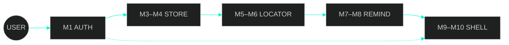
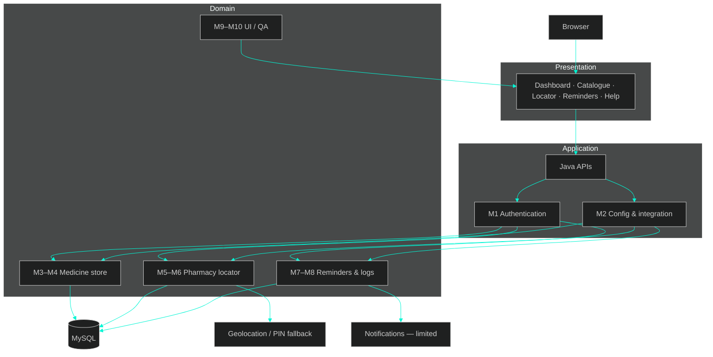
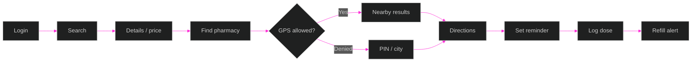
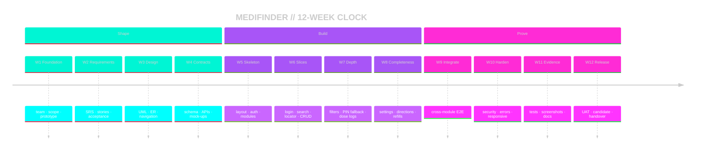
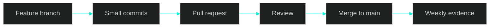

# MediFinder

<p align="center">
  
</p>

<p align="center">
  +route+around+denied+GPS;>+persist+doses+when+notifications+fail" alt="boot sequence">
</p>

```text
┌──────────────────────────────────────────────────────────────────────┐
│  MEDIFINDER   v.academic   ⟨ 06 JUL 2026  →  06 OCT 2026 ⟩          │
│  ──────────────────────────────────────────────────────────────────  │
│  SIGNAL   Java APIs · MySQL · 10 modules · 5 operators               │
│  MISSION  Find the medicine. Reach the pharmacy. Stay on the dose.   │
│  RULE     GPS-denied / empty-search / blocked-notify  =  designed    │
└──────────────────────────────────────────────────────────────────────┘
```

<p align="center">
  A five-operator <strong>Java</strong> web system that fuses <strong>catalogue search</strong>, <strong>pharmacy access with PIN fallback</strong>, and <strong>account-scoped adherence</strong>. Not a marketplace. Not a diagnosis engine. Not a promise of push delivery.
</p>

<p align="center">
  
  
  
  
  
</p>

<p align="center">
  <a href="[ADD REPOSITORY LINK]"></a>
  &nbsp;
  <a href="[ADD DEMO LINK]"></a>
  &nbsp;
  <a href="[ADD DEPLOYMENT LINK]"></a>
  &nbsp;
  <a href="#-twelve-week-build"></a>
</p>

<p align="center">
  
</p>

<p align="center">
  <a href="#-signal">Signal</a>
  · <a href="#-fault-lines">Fault lines</a>
  · <a href="#-the-stack-we-ship">Product</a>
  · <a href="#-capabilities">Capabilities</a>
  · <a href="#-module-grid">Modules</a>
  · <a href="#️-architecture">Architecture</a>
  · <a href="#-user-journey">Journey</a>
  · <a href="#-operators">Operators</a>
  · <a href="#-twelve-week-build">12-week build</a>
  · <a href="#-github-protocol">GitHub</a>
  · <a href="#-quality-grid">Quality</a>
  · <a href="#-interface">Interface</a>
</p>

---

## 📡 Signal

<table>
  <tr>
    <td align="center" width="25%">
      <br>
      <sub><code>DURATION</code></sub><br>
      <strong>12 weeks</strong><br>
      <sub>06 Jul → 06 Oct 2026</sub>
    </td>
    <td align="center" width="25%">
      <br>
      <sub><code>OPERATORS</code></sub><br>
      <strong>5 members</strong><br>
      <sub>one shared repository</sub>
    </td>
    <td align="center" width="25%">
      <br>
      <sub><code>GRID</code></sub><br>
      <strong>10 modules</strong><br>
      <sub>M1 — M10</sub>
    </td>
    <td align="center" width="25%">
      <br>
      <sub><code>CORE</code></sub><br>
      <strong>Java · MySQL</strong><br>
      <sub>JDBC · browser APIs</sub>
    </td>
  </tr>
</table>

| Channel | Reading |
|---|---|
| **Product** | Account-aware Java web platform for medicine search, pharmacy access, dose follow-up |
| **Target fault** | Split tools for catalogue, GPS-only locators, reminders that ignore permission limits |
| **Access** | Authenticated session (M1) — catalogue, locator and reminders stay account-scoped |
| **Honesty boundary** | Not a marketplace · not clinical diagnosis · not guaranteed push |
| **Status** | Academic engineering build · evidence-driven (PRs, checklists, screenshots) |

> `RULE_01` — GPS denied, empty search, and blocked notifications are **product paths**, not exceptions to hide.

---

## 🎯 Fault Lines

Medication days fail in three separate rooms. MediFinder wires them into one session.

<table>
<tr>
<td width="33%" valign="top">

<p align="center">
  
</p>

### `FAULT // CATALOGUE`

Brand vs generic, strength, pack, manufacturer, **MRP vs seller price**, source and last update time almost never live in one pane.

Case-sensitive or inconsistent fields return empty or wrong rows.

</td>
<td width="33%" valign="top">

<p align="center">
  
</p>

### `FAULT // LOCATOR`

A nearby-pharmacy screen that only speaks coordinates is dead when the browser **denies location**.

Users still need PIN / city fallback, a denied-permission state, and directions that do not fake GPS success.

</td>
<td width="33%" valign="top">

<p align="center">
  
</p>

### `FAULT // ADHERENCE`

Doses are taken, missed or skipped. Refills have thresholds. Browsers **limit notifications**.

A reminder that shows a different time after refresh is worse than no reminder.

</td>
</tr>
</table>

---

## 💡 The Stack We Ship

Ten owned modules. One session. One repository.

```text
▸ sign in
▸ search the catalogue
▸ open details & price provenance
▸ find a nearby pharmacy
▸ GPS  ||  PIN / city fallback
▸ open directions
▸ set a reminder
▸ log taken / missed / skipped
▸ watch refill warnings
▸ dashboard · profile · settings · help
```

| Layer | What the operator actually gets |
|---|---|
| **Identity** | Secure login, authorization, common API errors, account-scoped records |
| **Discovery** | Search / filter; manufacturer, strength, pack, MRP vs seller price, source, update time |
| **Access** | Map / list pharmacies, address & contact, permission handling, manual PIN fallback, directions |
| **Adherence** | Reminder CRUD, schedules, dose logs, refill warnings, notification-limitation messaging |
| **Shell** | Prototype-faithful UI, dashboard, profile, settings, help, QA evidence, demo support |



---

## ✨ Capabilities

<table>
<tr>
<td width="33%" valign="top">

### 🔐 Authentication
Registration, login, authorization around module pages, shared API error handling — every later module inherits a real user context.

</td>
<td width="33%" valign="top">

### 💊 Medicine discovery
Catalogue search and filters across brand / generic naming, with explicit **empty, loading and error** states.

</td>
<td width="33%" valign="top">

### 🏷️ Price provenance
Detail views surface manufacturer, strength, pack, **MRP vs seller price**, source, and last update time.

</td>
</tr>
<tr>
<td width="33%" valign="top">

### 🏪 Pharmacy locator
Nearby search as map / list, plus address and contact for a selected pharmacy.

</td>
<td width="33%" valign="top">

### 📍 Directions & fallback
Location permission is a first-class state. Denied / unavailable GPS → **manual PIN / city**, denied copy, directions, no-result handling.

</td>
<td width="33%" valign="top">

### ⏰ Reminders
Create, edit and delete schedules with dose instructions — persisted per account.

</td>
</tr>
<tr>
<td width="33%" valign="top">

### 📋 Dose tracking
Log **taken / missed / skipped** and keep history on the logged-in user.

</td>
<td width="33%" valign="top">

### 🔔 Refill alerts
Threshold-based refill warnings, plus honest copy for **browser notification limits**.

</td>
<td width="33%" valign="top">

### 👤 Shell & QA
Dashboard, profile, settings, help, guided UI, checklists, bug reports, screenshots, README.

</td>
</tr>
</table>

---

## 🧩 Module Grid

Ten modules. Five owners. No overlapping claims.

| ID | Module | Owner | Purpose |
|:---:|---|---|---|
| **M1** | Authentication & Accounts | Ratn Kumar Sharma | Java APIs, secure login, authorization, common errors |
| **M2** | API / Configuration / Integration | Ratn Kumar Sharma | API contracts, configuration, integration, code review |
| **M3** | Medicine Catalogue & Search | Vansh Oberoi | Search / filter over the medicine store |
| **M4** | Medicine Details & Price Provenance | Vansh Oberoi | Details, manufacturer / strength / pack, MRP vs seller price, source & update time |
| **M5** | Pharmacy Locator | Sumit Kumar Saini | Nearby pharmacy search, map / list, address / contact |
| **M6** | Directions & Location Fallback | Sumit Kumar Saini | Permission handling, manual PIN fallback, directions, no-result states |
| **M7** | Medicine Reminders | Sameer Achara | Create / edit / delete schedules and reminder forms |
| **M8** | Dose Logs & Refill Alerts | Sameer Achara | Taken / missed / skipped logs, refill warnings, notification limitations |
| **M9** | Dashboard / Profile / Settings / Help | Sachin Kumawat | Prototype style, guided UI, account-facing pages |
| **M10** | QA / Documentation / Demo | Sachin Kumawat | Test checklists, bug reports, screenshots, README, report |

<details>
<summary><strong>▸ module responsibility map</strong></summary>

<br/>

| Owner | Modules | Responsibility |
|---|---|---|
| **Ratn Kumar Sharma** | M1 · M2 | Java APIs, secure login, authorization, common errors, code reviews and integration |
| **Vansh Oberoi** | M3 · M4 | Search / filter, medicine details, manufacturer / strength / pack, MRP vs seller price, source and update time |
| **Sumit Kumar Saini** | M5 · M6 | Nearby pharmacy search, map / list, address / contact, permission handling and manual PIN fallback |
| **Sameer Achara** | M7 · M8 | Create / edit / delete schedules, taken / missed / skipped logs, refill warnings and notification limitations |
| **Sachin Kumawat** | M9 · M10 | Preserve prototype style, guided UI support, test checklists, bug reports, screenshots, README and report |

</details>

---

## 🏗️ Architecture

Conceptual only — Java APIs, MySQL, browser geolocation, browser notifications. Nothing else is drawn as if it exists.



| Layer | Responsibility |
|---|---|
| **Presentation** | Prototype-aligned screens for search, details, locator, reminders, dashboard, profile, settings, help |
| **Application** | Java APIs, secure login, authorization, shared configuration, integration seams |
| **Domain** | Catalogue, price provenance, locator, fallback, reminders, dose logs, refill alerts |
| **Data** | MySQL through JDBC |
| **Browser services** | Geolocation and notifications are **client capabilities**, not guaranteed server features |

Secrets, local server files and machine JDBC URLs stay **out of Git**.

---

## 🔄 User Journey



1. Sign in through **M1** so later records stay account-scoped.  
2. Search / filter the catalogue (**M3**), then open details with price provenance (**M4**).  
3. Locate a pharmacy (**M5**). If permission is denied, continue through **M6**.  
4. Create a reminder (**M7**), log taken / missed / skipped, follow refill warnings (**M8**).  
5. Use dashboard, profile, settings and help (**M9**) under the same visual system (**M10**).

---

## 👥 Operators

<p align="center"><em>one shared repository · one feature branch per operator · review before merge to main</em></p>

<table>
  <tr>
    <td align="center" width="20%">
      <br>
      <strong>Ratn Kumar Sharma</strong><br>
      <sub>Java Backend / Lead</sub><br><br>
      
      
      <br><br>
      <sub>APIs, secure login, authorization, common errors, reviews, integration</sub>
    </td>
    <td align="center" width="20%">
      <br>
      <strong>Vansh Oberoi</strong><br>
      <sub>Medicine Store</sub><br><br>
      
      
      <br><br>
      <sub>Search / filter, manufacturer, strength, pack, MRP vs seller price, source, update time</sub>
    </td>
    <td align="center" width="20%">
      <br>
      <strong>Sumit Kumar Saini</strong><br>
      <sub>Pharmacy Locator</sub><br><br>
      
      
      <br><br>
      <sub>Nearby search, map / list, address / contact, GPS permission, manual PIN fallback</sub>
    </td>
    <td align="center" width="20%">
      <br>
      <strong>Sameer Achara</strong><br>
      <sub>Reminders / Notifications</sub><br><br>
      
      
      <br><br>
      <sub>Schedule CRUD, taken / missed / skipped logs, refill warnings, notification limitations</sub>
    </td>
    <td align="center" width="20%">
      <br>
      <strong>Sachin Kumawat</strong><br>
      <sub>UI / UX, QA & Docs</sub><br><br>
      
      
      <br><br>
      <sub>Prototype style, guided UI, checklists, bug reports, screenshots, README</sub>
    </td>
  </tr>
</table>

Sameer Achara owns **only** M7 and M8. Sachin Kumawat leads guided UI, QA evidence and documentation.

---

## 🗓️ Twelve-Week Build

Academic window: **06 July 2026 → 06 October 2026**.

Source planning ran longer on paper. This README keeps a **strict 12-week clock** — later release / demo tasks are folded into Week 12, not invented as extra weeks.

```text
SHAPE          W1 Foundation → W2 Requirements → W3 Design → W4 Contracts
BUILD          W5 Skeleton   → W6 Slices       → W7 Depth  → W8 Completeness
PROVE          W9 Integrate  → W10 Harden      → W11 Evidence → W12 Release
```



<p align="center">
  
  
  
  
  
  
  
  
  
  
  
  
</p>

---

### WK-01  //  Foundation

<p>
  
  
  
</p>

> Boot the crew. Freeze the problem. Review the prototype intent before anyone writes schema.

**Objective.** Stand up the five-operator team, lock module ownership, write the first abstract, and review the prototype so later weeks do not argue about what MediFinder is.

**Why this week exists.** A 10-module Java web project fails when ownership is fuzzy. Week 1 makes M1–M10 named, visible, and bounded.

| Track | This week |
|---|---|
| **System (M1–M2)** | Confirm lead role: APIs, auth, integration, review protocol |
| **Store (M3–M4)** | Confirm catalogue / price-provenance boundary |
| **Locator (M5–M6)** | Confirm nearby search vs GPS-denied fallback as two modules |
| **Remind (M7–M8)** | Confirm reminder CRUD vs dose logs / refill alerts as two modules |
| **Shell (M9–M10)** | Confirm prototype-style ownership, QA and documentation lane |

**Deliverables**
- Team ownership table and module split  
- Project abstract  
- Prototype review notes  
- Shared-repo agreement (one repository, feature branch per member)

**Exit gate.** Every module has one owner. The problem statement is written. Prototype intent is reviewed — not implemented.

---

### WK-02  //  Requirements

<p>
  
  
  
</p>

> Turn “people cannot find medicines / pharmacies / doses” into rules a Java API can implement.

**Objective.** Produce the SRS, user stories, acceptance criteria and data-source research. Write GPS-denied, empty-search and notification-limit cases as **accepted behaviour**, not as stretch goals.

**Why this week exists.** Without acceptance criteria, search “works on my sample row”, the locator “works if you click Allow”, and reminders “work until refresh”.

| Track | This week |
|---|---|
| **System** | Auth stories: register, login, session, unauthorized access, common API errors |
| **Store** | Search / filter stories; detail fields including MRP vs seller price, source, update time |
| **Locator** | Nearby list / map stories; address / contact; permission denied as a first-class story |
| **Remind** | Reminder create / edit / delete; taken / missed / skipped; refill threshold; notification limits |
| **Shell** | Dashboard / profile / settings / help stories; evidence format for later QA |

**Deliverables**
- SRS  
- User stories + acceptance criteria  
- Data-source research notes  
- Honest scope cuts (no marketplace, no diagnosis, no guaranteed push)

**Exit gate.** A story can be tested. “GPS denied” has an expected UI. “Empty catalogue query” has an expected UI.

---

### WK-03  //  Design

<p>
  
  
  
</p>

> Draw the system before it is coded — users, flows, entities, navigation.

**Objective.** Produce use-case, activity, class and ER diagrams plus a navigation map so M1–M10 share one language.

**Why this week exists.** Locator fallback and reminder persistence both touch session + MySQL. If they invent parallel user models, Week 9 becomes archaeology.

| Track | This week |
|---|---|
| **System** | Auth use cases; session as a shared actor on every protected page |
| **Store** | Search → detail activity; price-provenance fields on the class / ER model |
| **Locator** | Locate → permission → results **or** PIN fallback → directions / no-result |
| **Remind** | Reminder → schedule → dose log → refill alert sequence |
| **Shell** | Navigation map: dashboard, profile, settings, help as the chrome around modules |

**Deliverables**
- Use-case diagram  
- Activity diagram  
- Class diagram  
- ER diagram  
- Navigation map

**Exit gate.** A new screen can be placed on the navigation map. An entity is not invented twice under two names.

---

### WK-04  //  Contracts

<p>
  
  
  
</p>

> Freeze schema, API contracts and UI mock-ups **before** feature code. This is the last cheap week to disagree.

**Objective.** Align database tables, Java API contracts and prototype-faithful mock-ups so Week 5 does not start five incompatible projects.

**Why this week exists.** Search filters, PIN fallback payloads, reminder schedules and dose-log status values must be named once.

| Track | This week |
|---|---|
| **System** | Auth API contracts; shared error shape; configuration seams |
| **Store** | Catalogue schema; search parameters; detail / provenance fields |
| **Locator** | Pharmacy + search-query tables; permission / fallback fields; directions payload |
| **Remind** | Reminder / schedule / dose-log / refill-alert tables; time-format convention |
| **Shell** | UI mock-ups for dashboard, profile, settings, help; visual tokens for shared layout |

**Deliverables**
- Database schema  
- API contracts  
- UI mock-ups  
- Timezone / datetime convention note for reminders (so Week 10 is not a surprise)

**Exit gate.** A mock-up has a matching API field. A table has an owner. Credentials are **not** in the contract docs as committed secrets.

---

### WK-05  //  Skeleton

<p>
  
  
  
</p>

> Stand up the shared application: layout, auth foundation, catalogue schema, empty module frames.

**Objective.** One runnable Java web skeleton on the agreed server setup, MySQL reachable through JDBC, shared chrome in place, module folders owned.

**Why this week exists.** Feature work on five branches is useless if Tomcat / JDBC / layout cannot boot as one app.

| Track | This week |
|---|---|
| **System** | Shared layout, auth foundation, JDBC utility, common errors — secrets stay local |
| **Store** | Catalogue schema in MySQL; empty search / detail frames |
| **Locator** | Pharmacy tables; empty list / map frames |
| **Remind** | Reminder / log tables; empty form frames |
| **Shell** | Prototype layout applied to the shared chrome; skeleton pages for dashboard / help |

**Deliverables**
- Shared layout  
- Auth foundation (not the finished account product)  
- Catalogue schema  
- Module skeletons in the common repo

**Exit gate.** The app starts. A protected route exists. Five feature branches can open against `main` without inventing a second layout.

**Known failure class (record only if it happens).** MySQL / JDBC connection mismatch — diagnose, align config, keep secrets out of Git.

---

### WK-06  //  Vertical Slices

<p>
  
  
  
</p>

> First real path per domain: login, search / detail, locator prototype, reminder CRUD.

**Objective.** Each domain proves a thin vertical slice — UI → Java API → MySQL — still incomplete on purpose.

**Why this week exists.** Depth (filters, PIN fallback, dose logs) is next. Slices first, polish later.

| Track | This week |
|---|---|
| **System** | Registration / login / logout / session on protected pages |
| **Store** | Search → detail happy path (filters and edge cases still open) |
| **Locator** | Locator prototype: list / map against seed data (fallback not finished) |
| **Remind** | Reminder create / edit / delete for the logged-in user |
| **Shell** | Navigation to the new slices without breaking prototype chrome |

**Deliverables**
- Working registration / login  
- Search / detail slice  
- Locator prototype  
- Reminder CRUD slice

**Exit gate.** A signed-in user can hit store, locator and reminder pages. GPS-denied, dose logs and refill rules are **not** claimed done.

---

### WK-07  //  Depth

<p>
  
  
  
</p>

> Connect UI to APIs with real input: filters, PIN fallback, dose logs.

**Objective.** Make the slices survive messy humans — case / field mismatch in search, denied GPS, actual dose states.

**Why this week exists.** Source milestone is explicit: **UI / API integration, filters, PIN fallback and dose logs**.

| Track | This week |
|---|---|
| **System** | Integration review; shared error responses for bad payloads |
| **Store** | Search filters; case-insensitive / field mapping; empty-query response |
| **Locator** | Manual PIN / city fallback when GPS is denied or unavailable |
| **Remind** | Taken / missed / skipped dose logs against reminder records |
| **Shell** | Loading / empty / error presentation consistent with prototype |

**Deliverables**
- UI ↔ API integration on the live slices  
- Catalogue filters  
- PIN fallback path  
- Dose-log states

**Exit gate.** Denied GPS does not dead-end the locator. An empty search is a state, not a blank page. Dose log has three explicit statuses.

**Known failure class (record only if it happens).** Catalogue search returning wrong / empty rows from inconsistent naming — standardise mapping, add empty-query behaviour, retest.

---

### WK-08  //  Completeness

<p>
  
  
  
</p>

> Close owned edges: profile / settings, catalogue edge cases, directions, refill rules.

**Objective.** Finish the demonstrable surface of each module so Week 9 can integrate instead of inventing leftover screens.

**Why this week exists.** Source milestone: **profile / settings, catalogue edge cases, directions and refill rules**.

| Track | This week |
|---|---|
| **System** | Auth + API hardening around the new settings / profile calls |
| **Store** | Catalogue edge cases: no hit, partial name, brand vs generic |
| **Locator** | Directions links from a selected pharmacy; no-result copy; permission-denied message |
| **Remind** | Refill-threshold rules; notification permission + limitation messaging |
| **Shell** | Profile / settings / help pages in prototype style |

**Deliverables**
- Profile / settings  
- Catalogue edge-case handling  
- Directions + no-result  
- Refill rules + notification-limit copy

**Exit gate.** Each of M1–M10 has a demonstrable screen or evidence lane. Cross-module E2E is next, not more features.

---

### WK-09  //  Integrate

<p>
  
  
  
</p>

> One journey across ten modules. Session, MySQL and chrome must survive the hand-offs.

**Objective.** Module integration and end-to-end tests: login → search → details → locate (GPS or PIN) → remind → log → refill, inside the dashboard shell.

**Why this week exists.** Separately “done” modules still collide on session keys, shared CSS and user-id foreign keys.

| Track | This week |
|---|---|
| **System** | Cross-module session; API error consistency; merge review |
| **Store** | Search / detail inside the full journey, not a standalone page |
| **Locator** | GPS-allowed **and** GPS-denied journeys in the same session |
| **Remind** | Reminder + dose log + refill after a store / locator visit |
| **Shell** | E2E script, checklists, first bug list — no invented pass rates |

**Deliverables**
- Integrated navigation across M1–M10  
- End-to-end test pass (happy + denied-GPS)  
- Open defect list for Week 10

**Exit gate.** A single logged-in user can complete the journey. Defects are listed, not hidden.

**Known failure class (record only if it happens).** Locator dead when GPS permission is denied — fallback must already exist; this week proves it inside E2E.

---

### WK-10  //  Harden

<p>
  
  
  
</p>

> Make failure states first-class: security, validation, responsive UI, error-state fixes.

**Objective.** Close integration defects. Validate inputs. Keep the prototype layout at different widths. Treat error pages as designed surfaces.

**Why this week exists.** Source milestone: **security, validation, responsive UI and error-state fixes**. Reminder datetime drift after refresh is a named risk.

| Track | This week |
|---|---|
| **System** | Authz on every write; validation; safer error reporting; JDBC config hygiene |
| **Store** | Query / filter validation; empty / error / loading states at smaller widths |
| **Locator** | Invalid PIN, no-result, denied permission — copy and layout pass |
| **Remind** | Consistent date/time parse; refill recalculation after a log; notify-limit copy |
| **Shell** | Responsive chrome; screenshot-based visual check vs prototype |

**Deliverables**
- Security / validation pass  
- Responsive UI pass  
- Error-state fixes  
- Regression on Week 9 journeys

**Exit gate.** High-priority defects from Week 9 are closed or explicitly deferred. Reminder time after refresh is tested.

**Known failure class (record only if it happens).** Reminder time changes after refresh — lock one datetime convention, retest create / edit / refresh / repeat.

---

### WK-11  //  Evidence

<p>
  
  
  
</p>

> Prove behaviour. Not vibes. System tests, screenshots, documentation that matches the running app.

**Objective.** Capture test evidence, update docs, clean the repo, freeze feature scope.

**Why this week exists.** Source milestone: **system tests, test evidence and documentation updates**. Evaluators should not have to imagine GPS-denied or refill-limit screens.

| Track | This week |
|---|---|
| **System** | Auth evidence: valid / invalid credentials, session expiry |
| **Store** | Search hit / miss / filter evidence; provenance fields visible |
| **Locator** | Allowed GPS, denied GPS, invalid PIN, directions, no-result captures |
| **Remind** | CRUD, three dose states, refill threshold, notification-limit messaging |
| **Shell** | Checklists, bug reports, screenshot pack, README alignment, repo hygiene |

**Deliverables**
- System test notes  
- Screenshot / evidence pack (`docs/screenshots/`)  
- Documentation updates  
- Ignored local server / secret files verified

**Exit gate.** README does not describe screens that were never built. Every owner has evidence for their modules.

---

### WK-12  //  Release

<p>
  
  
  
</p>

> UAT, last fixes, candidate, demo, handover — **still inside the 06 October close**. No thirteenth week.

**Objective.** User acceptance against stories and prototype style, bug fixes, deployment preparation, final README, contribution evidence.

**Why this week is longer on the calendar.** Source planning listed extra late-September / October beats (release candidate, regression, final demo). They are **compressed here**, not extended past 06 Oct 2026.

| Window inside Week 12 | Focus |
|---|---|
| **21–27 Sep** | UAT, bug fixes, deployment preparation |
| **28 Sep–04 Oct** | Release candidate, README / report freeze, demo script |
| **05–06 Oct** | Final regression, repository tag / evidence, handover |

| Track | This week |
|---|---|
| **System** | Candidate build, config notes, no secrets in Git, merge discipline |
| **Store** | UAT on search / detail / provenance |
| **Locator** | UAT on GPS-on, GPS-off, directions |
| **Remind** | UAT on schedules, logs, refill, notification limits |
| **Shell** | Demo rehearsal, visual regression vs prototype, final docs |

**Deliverables**
- UAT notes  
- Final bug-fix pass (no new modules)  
- Release candidate  
- Final README + evidence  
- Demo / handover pack

**Exit gate.** One repository. One demo path. Honest “no major blocker” if that is the truth.

**Known failure class (record only if it happens).** Merge conflict on shared CSS breaking dashboard spacing — restore prototype tokens, screenshot-check catalogue / locator / reminder / dashboard.

---

### Clock vs source (honest)

| This README | Source beats absorbed |
|---|---|
| Weeks 1–11 | Direct map to source Weeks 1–11 |
| Week 12 (21 Sep–06 Oct) | Source Week 12 UAT + later release-candidate / regression / final-demo beats |

College portal numbering wins if it differs.

---

## 🔀 GitHub Protocol

One shared repository. **A separate feature branch per operator.** Review before `main`.



| Rule | Practice |
|---|---|
| **One repo** | All five operators ship in the same project |
| **Branch per member** | Feature work stays isolated until reviewed |
| **Small commits** | Messages describe the change — not “update” |
| **PR before main** | Review, then merge. Unmerged PRs are reported honestly |
| **Weekly evidence** | Report includes `[REPOSITORY URL]` plus that week’s `[PR LINK]` / `[COMMIT LINK]` |
| **No fiction** | Commits, issues, errors and results are recorded only when they exist |

Ten modules share layout, session and MySQL. Isolated branches plus review catch CSS collisions, API drift, and machine-specific JDBC config before they reach `main`.

```text
Repository : [REPOSITORY URL]
This week  : [PR LINK]   ·   [COMMIT LINK]
Demo       : [ADD DEMO LINK]
```

---

## 🧪 Quality Grid

Planned test types — **not** fabricated pass rates.

| Layer | What is exercised | Typical owners |
|---|---|---|
| **Functional / module** | Auth, catalogue search, details, locator, reminders, dose logs, dashboard | Module owners |
| **Integration** | UI ↔ Java API ↔ MySQL; shared session across M3–M8 | M1 / M2 + owners |
| **Edge cases** | Empty search, GPS denied, invalid PIN, no results, blocked notifications, reminder time after refresh | M3–M8 + M10 |
| **System / E2E** | Login → search → details → locate → remind → log → refill | Whole team |
| **Regression** | Re-run happy paths after CSS / API / schema fixes | M10 + owners |
| **UAT** | Walkthrough against acceptance criteria and prototype style | Week 12 · M9 / M10 |
| **Evidence** | Checklists, bug reports, screenshots, README | M10 |

**Failure classes treated as normal test cases**

- MySQL / JDBC connection or configuration mismatch  
- Search returning wrong or empty rows from case / field inconsistency  
- Locator unusable when GPS permission is denied  
- Reminder time shifting after refresh (parse / timezone)  
- Merge conflicts on shared CSS breaking dashboard layout  

If a week had no major error, **say so**. Do not invent one.

---

## 📊 How The Product Takes Shape

```text
 Idea            search + locate + adhere as one web product
  ↓
 Requirements    SRS, stories, acceptance, data-source research
  ↓
 Design          use-case / activity / class / ER, navigation map
  ↓
 Contracts       schema, API contracts, UI mock-ups
  ↓
 Build           auth · catalogue · locator · reminders · dashboard
  ↓
 Integration     shared layout, session, MySQL, cross-module journeys
  ↓
 Testing         module, integration, edge cases, system tests
  ↓
 UAT             acceptance against prototype and stories
  ↓
 Candidate       bug fixes, docs, evidence pack
  ↓
 Demo            repository, contribution evidence, handover
```

| Gate | Meaning |
|---|---|
| **Contracts before code** | Schema + API + mock-ups freeze in Week 4 |
| **Slices before polish** | Login / search / locator / reminder CRUD exist before edge-case work |
| **Fallback is a feature** | GPS-denied is a designed path |
| **Evidence over claims** | Screenshots, PRs and checklists — no invented metrics |

---

## 📸 Interface

Drop real captures into `docs/screenshots/`. Frames below are **slots**, not product photos.

<table>
  <tr>
    <td align="center" width="50%">
      <br>
      <sub><strong>Authentication</strong> · <code>docs/screenshots/01-auth.png</code></sub>
    </td>
    <td align="center" width="50%">
      <br>
      <sub><strong>Medicine search</strong> · <code>docs/screenshots/02-search.png</code></sub>
    </td>
  </tr>
  <tr>
    <td align="center">
      <br>
      <sub><strong>Details / price provenance</strong> · <code>docs/screenshots/03-details.png</code></sub>
    </td>
    <td align="center">
      <br>
      <sub><strong>Pharmacy locator</strong> · <code>docs/screenshots/04-locator.png</code></sub>
    </td>
  </tr>
  <tr>
    <td align="center">
      <br>
      <sub><strong>GPS denied / PIN / directions</strong> · <code>docs/screenshots/05-fallback.png</code></sub>
    </td>
    <td align="center">
      <br>
      <sub><strong>Medicine reminder</strong> · <code>docs/screenshots/06-reminder.png</code></sub>
    </td>
  </tr>
  <tr>
    <td align="center">
      <br>
      <sub><strong>Dose log / refill alert</strong> · <code>docs/screenshots/07-dose-log.png</code></sub>
    </td>
    <td align="center">
      <br>
      <sub><strong>Dashboard / profile / help</strong> · <code>docs/screenshots/08-dashboard.png</code></sub>
    </td>
  </tr>
</table>

<p align="center">
  <sub>Replace placeholder URLs with <code>docs/screenshots/0N-….png</code> after you drop files.</sub><br>
  Demo: <a href="[ADD DEMO LINK]">[ADD DEMO LINK]</a>
  · Deployment: <a href="[ADD DEPLOYMENT LINK]">[ADD DEPLOYMENT LINK]</a>
</p>

---

## 📁 Project Structure

```text
[ADD ACTUAL PROJECT STRUCTURE HERE]
```

Until the tree is pasted, treat **M1–M10** as folder ownership. Shared layout, auth and API configuration live with **M1 / M2** — do not duplicate them per feature branch.

---

## 🛠️ Stack

Only what the project specifies.

| Concern | Choice |
|---|---|
| Backend | Java APIs |
| Data | MySQL |
| Connectivity | JDBC — URL, database, credentials **never committed** |
| Client location | Browser geolocation + manual PIN / city fallback |
| Alerts | Browser notifications, with documented limitations |
| UI | Shared layout preserving the approved prototype |

<p align="center">
  
</p>

---

## 📋 Reporting

Each operator files **their own daily log and weekly report**. Points only with evidence.

**Daily log**

| Field | Content |
|---|---|
| Date | Actual work date |
| Hours | Actual hours |
| Status | Completed / In Progress / Blocked |
| Work | Action + module + result |
| Evidence | Commit / PR, test, screenshot or document |
| Blocker / next | Error, discussion, fix, or next action |

**Weekly scorecard (max 100)**

| Criterion | Points |
|---|---|
| Assigned tasks completed | 40 |
| Quality and testing | 20 |
| GitHub evidence | 15 |
| Documentation / reporting | 10 |
| Team discussion / collaboration | 10 |
| Next-week plan | 5 |

Weekly pack: date range, completed-work bullets, score breakdown, `[REPOSITORY URL]`, `[PR LINK]` / `[COMMIT LINK]`, problems faced **or** “no major blocker”, specific next-week plan.

---

## 🚀 Getting Started

```text
[ADD SETUP STEPS]
[ADD DATABASE SCRIPT]
[ADD LOCAL RUN COMMAND]
[ADD ENVIRONMENT / JDBC NOTES]
```

1. Clone `[REPOSITORY URL]`  
2. Create the MySQL schema from the project script  
3. Configure JDBC locally — do not commit credentials  
4. Run the Java web application with the team’s agreed server setup  
5. Sign in, then exercise search → locator → reminders on a **feature branch**

---

## 📚 Docs Index

| Document | Location |
|---|---|
| SRS / user stories / acceptance criteria | `[ADD DOCUMENTATION LINK]` |
| UML / ER / navigation map | `[ADD DOCUMENTATION LINK]` |
| API contracts | `[ADD DOCUMENTATION LINK]` |
| UI mock-ups / prototype | `[ADD DOCUMENTATION LINK]` |
| Test checklists & bug reports | `[ADD DOCUMENTATION LINK]` |
| Weekly reports | `[ADD DOCUMENTATION LINK]` |

---

## 🤝 Working Agreements

- Feature branch per member; **review before merge to main**.  
- Shared CSS / layout files have a clear owner — discuss before rewriting them.  
- GPS denied, empty search, and blocked notifications are **expected test cases**.  
- Sachin Kumawat leads guided UI, QA evidence and documentation.  
- Sameer Achara owns **M7** and **M8** only.  
- Use the college portal’s week numbering if it differs from this calendar.

---

<p align="center">
  
</p>

<p align="center">
  
  
  
</p>
